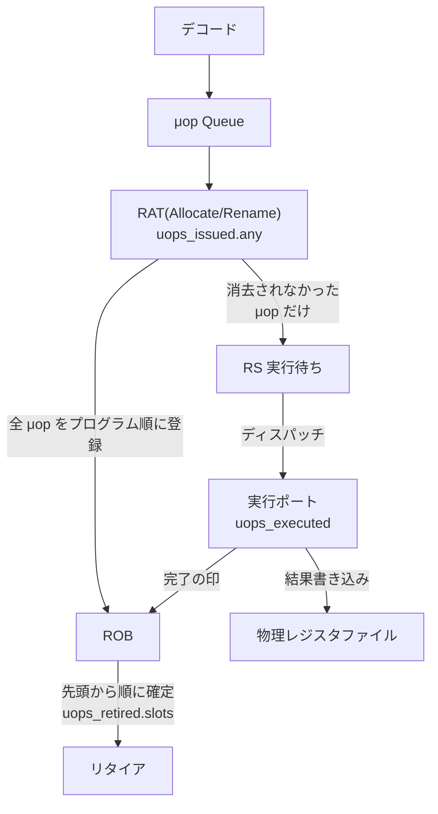

## はじめに
一見、タイトルはなんのこと? と思われるかもしれませんが、そう呼びたくなる現象があるのをつい最近（2026年8月）知りました。面白かったのでその紹介をします。なお、かなり専門的な話となりますのであしからず。

## 命令のレイテンシを測定する
プログラムの最適化の作業の中でx64のタイムスタンプカウンターtscを取得する命令rdtscを使ってマイクロベンチマークをいろいろとっていました。現在、rdtscはCPUのある固定周波数を基準としたtscを測定します。
私はCPUをフルで回したときの周波数に対するクロックサイクル（以下cycと略記）を測定したかったので、次の方法をとりました。

まず、add(rax, rax)みたいな1cycかかると分かっている命令を並べてそれにかかったtscを測定します。以下のアセンブリ言語のコードは[Xbyak](https://github.com/herumi/xbyak)で記述しています。後述のコードもXbyakが必要です。

*関数f0()*
```cpp
    static const uint64_t N = 1000000000;
    static const int UNROLL = 8;
    align(16);
    Label lpL;
    mov(ecx, N); // 10億回ループ
L(lpL);
    for (int i = 0; i < UNROLL; i++) add(rax, rax); // 8回アンロール
    dec(ecx);
    jnz(lpL);
    ret();
```

*f0()のadd 1回あたりにかかったtscを計測する*
```cpp
typedef void (*Func)();
double measure(Func f)
{
  Clock clk; // rdtscを読み出すラッパークラス
  clk.begin();
  f();
  clk.end();
  return clk.getClock() / double(N);
}
double rate = measure(f0) / UNROLL;
```

連続するadd(rax, rax)は依存関係があるので必ず1cycかかります。それをUNROLL(=8)回並べてdec(ecx); / jnz(lpL);でループします。
dec+jnzはマクロフュージョンされて1μopになります。addとは同時実行されるのでtscを測定するときは無視できます。
ループ全体でかかったtscをループ回数とアンロール回数で割れば、結局measureで返される値rateはadd 1命令にかかった固定周波数でのtscです。

たとえば、固定周波数が2GHzで実行時に4GHzで動いていればrate = 2/4 = 0.5となります。逆に言えば、その後rdtscで測定したtscをrateで割れば稼働時の周波数におけるcycをえられます。このようにしてimul(rax, rax);をN回ループするcycを測定すると1命令あたり2.97とでました（多少変動します）。仕様上は3cycなので検算できているのが分かります([cyc-mul-addi.cpp](https://github.com/herumi/misc/blob/main/cyc-mul-addi.cpp))。

## 現象に遭遇したきっかけ
さて、本題です。Sapphire Rapids(w9-3495X)でいろいろなベンチマークをとっているときに

```cpp
for (int i = 0; i < 8; i++) add(rax, 1);
```
の結果が1.57cycと出たのです。最初に述べたように連続するadd(rax, 1)は一つあたり1cycかかるので8cycとなるはずです。実際add(rax, rax)は8cycです。それが1.57cycとは変です。
ループを伸ばして16個のaddにしても3.02cycとなりました。1命令あたり0.2cycとなってしまってます。

## CPUの内部
何が起こっているのか観察する前にCPUの内部の話をざっと説明しましょう。

*[Intel 64 and IA-32 Architectures Optimization Reference Manual, v50, Volume 1](https://www.intel.com/content/www/us/en/developer/articles/technical/intel64-and-ia32-architectures-optimization.html) Figure 2-2.よりGolden Coveの図を引用*


x64の命令はμopにデコードされた後、μop Queueに入ります。この段階ではマクロフューズされた命令(dec+jnz)はペアのまま流れます。
RAT (Register Alias Table)はraxなどの論理レジスタと内部の物理レジスタとの対応を管理するrenameを行います。movやxor R, Rなどを削除するMove EliminationやZero idiomもRATで行われます。そしてAllocate/Renameでプログラムの実行順序を管理するROB(Reorder Buffer)に登録します。
同時にOut-of-Orderのために命令をスケジューラであるRS(Reservation Station)にも登録します。RSは空いてるポートにμopを供給（ディスパッチ）します。
最後に実行ポートの結果を物理レジスタに反映し、ROBに完了の合図を送ってリタイアさせます。



Agner Fogの資料ではデコード→RAT→ROBでは（load+ALUやstore用のアドレス確定STAとデータを書き込むSTDのSTA+STDなど）μopを融合したまま処理するfused domain, RS→実行ポートではそれらを別々に管理するunfused domainと呼んでいます。

## perfで確認する
前節のcyc-mul-addi.cppをadd reg 8回のループ(A: mode 0)とadd imm 16回のループ(B: mode 4)とを比較しました。

RATを通った回数、実行ポートの回数、ROBで処理した回数などを測定するためperfは次のオプションを利用しました。

```
perf stat -e '{instructions,uops_issued.any,uops_executed.thread,uops_retired.slots,inst_retired.macro_fused}:u' ./a.out <mode>
```

(A)ではaddx8のループを1セットとして、CPUのwarmupに1回+rateの計測に5回+本来の測定1回で計7回です。1ループあたり10億回回ります。したがって「(A)のperfの結果/(7 x 10億)」が一つのイテレーションあたりの値になります。
実際instructionsは70001837791だったので7e9でわると10となり、addx8の命令数は「add x 8 + dec x 1 + jnz x 1」で10命令あり、正しいことが分かります。

(B)では(A)のaddx8ループが6回と本来の測定addix16のループ1回です。したがって「(B)の結果/10億-(A)の各イテレーションの値x6」が一つのイテレーションの値となります｡

手元では測定していたのですが32bitレジスタに対する加算`add(eax, 1);x8`のループ(C: mode 5)も追加しました。フュージョンには関係が無かったのでいれてませんでした。

結果を表にすると次のようになりました。

*perfによるSapphire Rapids(Golden Cove)での実行結果を1ループあたりのcycとしてまとめたもの*

カウンタ|意味|(A) addx8|(C)add32ix8|(B)addix16|(B)-(A)
-|-|-|-|-|-
instructions                   |命令数| 10|10         | 18            |+8
uops_retired.slots|リタイアしたスロット数| 9|9          | 17            |+8
uops_issued.any|RATで発行された(fused)μop数| 9|9          | 17            |+8
uops_executed.thread|実行ポートに渡ったμop数| 9|9          |  5             |-4
inst_retired.macro_fused       |マクロ融合した命令数| 1|1|1| 1
サイクル/イテレーション        |1ループあたりのcyc| 7.94|7.98          | 3.02             |-4.92

(A)と(C)の結果はほぼ同一でした。つまり想定される状況です。

(B)はaddi x 16と(A)よりも8個分add命令が多いのでinstructions, uops_retired.slots, uops_issued.anyが+8なのは正しいです。
ところが実行ポートで実際に処理した回数uops_executed.threadは本来8増えているはずなのに逆に(A)よりも4少ないです。つまり全体では12個分のaddiが実行ポートに渡っていません。Allocate/Renameの段階で除去されて、複数の即値加算命令が一つの即値加算命令に置き換えられているのでは?と考えられます。(B)と(C)の違いはeaxかraxなのでこれは64bitレジスタに対してのみ発動するようです。

uops_executed=5ということはdec+jnzを除けばaddにかかっている処理は4です。それなのに1ループあたり3cycしかかかっていないのは不思議ですね。Golden CoveのAllocate幅は6（前述のIntel最適化マニュアルp.2-10の「Wider machine: 5→6 wide allocation」）なので17μopは17/6 = 2.83cycで処理されます。フロントエンドが律速になっているのかもしれません。

## 他の命令でも試す
そうすると気になるのはadd(rax, 1)だけなのかということです。そこで1を別の値にしたり、add(rax, 1); add(rax, 2); ...のように変えたり、大きな値にしたりして試しました([add-imm-renamer.cpp](https://github.com/herumi/misc/blob/main/add-imm-renamer.cpp)）。
するとそれらでもフュージョン（この現象をこう呼ぶことにする）しました。ただ即値が符号つき11ビット([-1024, 1023])の外だとフュージョンしなくなりadd(rax, rax)と同じ速度になることが分かりました。っd


*add-imm-renamer.cppの測定結果（一部）*

arch|imm=1|imm=2|imm=127|imm=1023|imm=1024|add 1..8|add+sub|inc|lea
-|-|-|-|-|-|-|-|-|-
Cascade Lake|7.97|8.00|7.98|7.92|8.00|7.99|8.00|7.97|7.99
Sapphire Rapids|1.91|1.95|2.58|3.98|7.65|1.99|1.98|1.96|1.95

Cascade Lake（Skylakeアーキテクチャ）は種別によらず8cycで一定なのに対し、Sapphire Rapids（Golden Coveアーキテクチャ）は項目によって速度が変わっています。アーキテクチャの違いが明らかです。
imm=1, 2, 127, 1023, 1024はadd(rax, imm)のimmを変えたもので値が増えるごとに多少遅くなりimm=1024でほぼ通常の速度に戻っています。

即値を変えたadd 1..8やaddとsubをまぜたadd+sub, addの代わりにincを並べたものでも速くなっています。内部的に即値の加算をまとめて1~2回の演算ですませるようになっているのでしょう。
面白いのはleaで、実際には次のコードを動かしました。

```cpp
 lea(rcx, ptr[rax+0]); // rcx = rax + 0
 lea(r8, ptr[rcx+1]); // r8 = rcx + 1
 lea(r9, ptr[r8+2]); // r9 = r8 + 2
 lea(rax, ptr[r9+3]); // rax = r9 + 3
 lea(rcx, ptr[rax+4]); // rcx = rax + 4
 lea(r8, ptr[rcx+5]); // r8 = rcx + 5
 lea(r9, ptr[r8+6]);  // r9 = r8 + 6
 lea(rax, ptr[r9+7]); // rax = r9 + 7
 ```

このような依存関係が連鎖しているものでも2cycで動いているということはレジスタリネーミングしていてもフュージョンできることになります。

## ヘテロアーキテクチャでの結果
Alder LakeやArrow LakeなどはP-coreとE-coreが混在するハイブリッドアーキテクチャです。これらでどのような結果になるか試してみました。

手元の Core i7-1255U(Alder Lake)はP-coreがGolden CoveでE-coreがGracemontです。フュージョンの現象はP-coreしか発生しませんでした。
Core Ultra 7 255H(Arrow Lake)はP-coreのLion Cove, E-coreのSkymontに加えて低電力E-coreのCrestmontと3種類あります。

Windowsマシンなのでベンチマークは

```
start /b /wait /affinity <番号> <実行ファイル>
```
という形でとりました。`<番号>`は0x1(P-core), 0x8(E-core), 0x4000(LP E-core)を指定しました。実験の詳細は[add-imm-renamer.cpp](https://github.com/herumi/misc/blob/main/add-imm-renamer.cpp)を見ていただくとして概要をまとめると次のようになります。

*ヘテロアーキテクチャでの測定結果*

| | Golden Cove (1255U P) | Gracemont (1255U E) | Lion Cove (255H P) | Skymont (255H E) | Crestmont(255H LP-E) |
|---|---|---|---|---|---|
| フュージョン | あり | なし | あり | あり | なし |
| 即値の範囲 | -1024〜1023 (11bit) | - | -512〜511 (10bit) | -2048〜2047 (12bit) | - |
| 範囲内の挙動 | 即値が大きいほど劣化 | - | 同左（劣化は2倍速い） | 平坦 | - |
| 即値の大きさ別 | 127→2.5, 255→2.9, 511→3.7, 1023→4.2 | 全部 8.0 | 127→3.1, 255→4.3, 511→4.5 | 全部 2.1 | 全部 8.0 |
| 累積和の影響 | あり (13bit) | - | あり (12bit) | なし | - |
| 最速値 (imm=1) | 1.5 | 8.0 | 1.5 | 2.1 | 8.0 |
| sub | フュージョン| - | フュージョン | フュージョンするが add との混在で壊れる並びがある | - |
| inc x8 | 1.5 | 8.0 | 1.5 | 4.0（半分） | 8.5 |
| lea 連鎖 | 1.6| 8.0 | 7.9 | 7.9 | 8.0 |

Golden CoveからLion Coveへの大きな変更点として

- 即値の範囲が11bitから10bitに減った
- lea連鎖はフュージョンしなくなった

があります。またAlder LakeのE-coreはフュージョンしなかったのにArrow LakeのE-core(Skymont)はフュージョンし、かつ

- 即値の範囲が12bitに増えた
- 即値の累積和の影響が無くなった
- incの連鎖のフュージョン性能は劣化した

など、良くなった点と悪くなった点があります。

## 累積和の影響について
表中の「累積和の影響」については、即値の和が一定値を越えると新しくaddを発行しているというモデルを考えると説明がつけられます。
このモデルの妥当性を検証するためにadd(rax, 1000); sub(rax, 1000);を並べたパターンでも測定してみました。

```cpp
for (int i = 0; i < 8; i++) {
  if (i & 1) sub(rax, 1000); else add(rax, 1000);
}
```

*累積和を抑えたときの測定結果（8命令1回あたりのcyc、フュージョンしなければ8）*

並べた命令|Golden Cove (i7-1255U)|Sapphire Rapids (w9-3495X)
---|---|---
add(rax, 1) x8|1.52|1.91
add(rax, 1023) x8|4.15|3.98
add(rax, 1000) / sub(rax, 1000) 交互x4|1.58|1.93

add(rax, 1023)を8回並べるよりadd/sub交互x4の方が速くなりました。即値の大きさそのものではなく累積和が影響していることの傍証です。add(rax, 1000+i)を4個並べてからsub(rax, 1000+i)を4個並べる形（累積和は一度4006まで上がってから戻る）でもGolden Coveで1.49とフュージョンしているので、累積和のフィールドは即値のフィールドより広く、13ビット程度あるように見えます。

なおadd/sub 1000の命令列をLion Cove(Core Ultra 7 255H)で走らせるとまったくフュージョンしませんでした。こちらは即値1000がフュージョン可能な範囲[-512, 511]を外れているためで、累積和とは別に即値そのものの範囲制限がかかることが分かります。

## まとめ
Golden Coveなどの最近のIntel CPUでは、連続する即値加算命令(add imm)や減算命令(sub imm)をフュージョンして、実行ポートに渡すμopの数を減らす機能があることが分かりました。ただし、この機能は公式ドキュメントには記載されておらず、フュージョンできる即値の範囲などの詳細も世代によって異なるようです。

push/popなどで連続するrspの加算をまとめる機能(stack engine)が汎用化されて表に出てきたところでしょうか。実際のところ、汎用化されたこの機能がどこまで性能向上に役立つのか分からないところもあります。もしかしたら将来は無くなってしまう機能かもしれませんね。

## 参考

IntelのArchitecture Day 2021 で「increased amount of dependency resolution at the allocation stage, actually eliminating instructions ...」という発言はあったそうです（[web.archive/www.anandtech.com](https://web.archive.org/web/20230104045735/https://www.anandtech.com/show/16881/a-deep-dive-into-intels-alder-lake-microarchitectures/3)）が詳細は不明です。

PS. ある程度調べていたところで、数年前にこの現象を調べている先駆者がいたことが分かりました。

- [Zero-cycle constant adds 2023/12/23](https://www.complang.tuwien.ac.at/anton/additions/)
- [The Case of the Missing Increment 2024/9/27](https://www.computerenhance.com/p/the-case-of-the-missing-increment)
