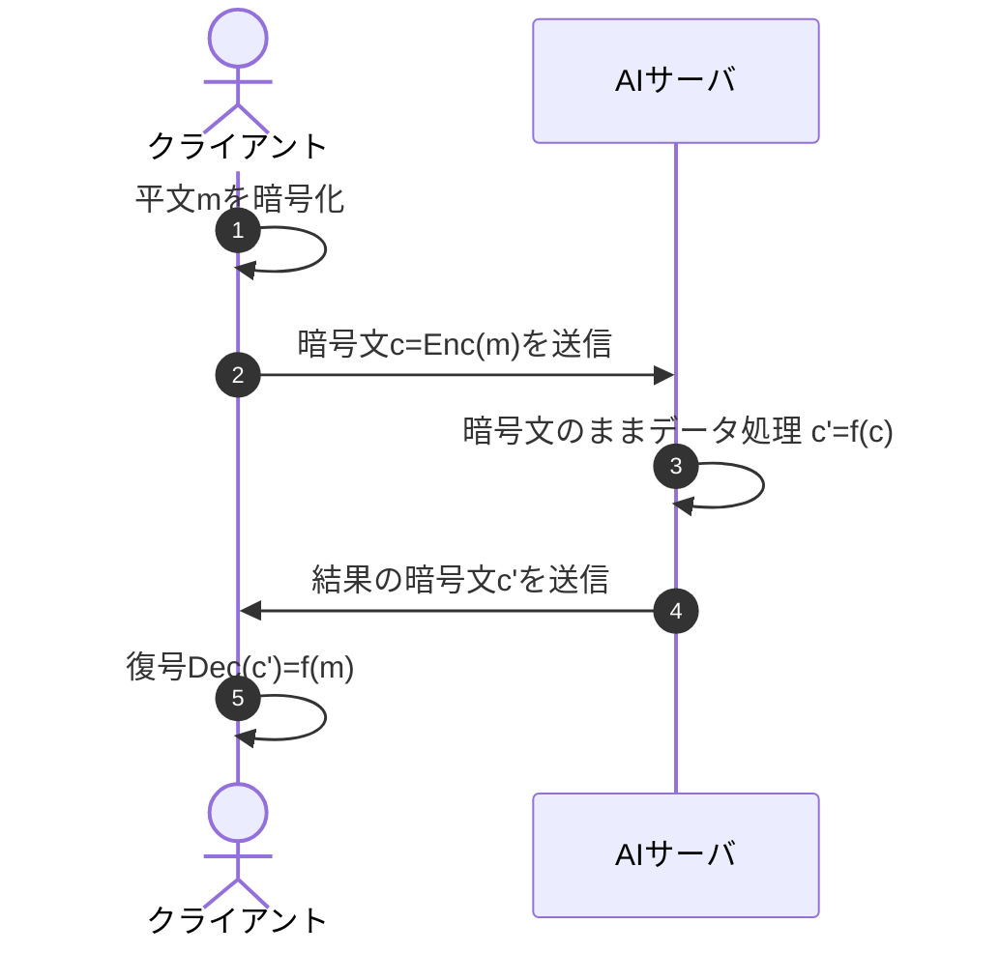

## 初めに
これからしばらく完全準同型暗号の一方式[CKKS (Cheon-Kim-Kim-Song)](https://eprint.iacr.org/2016/421)を紹介します。Microsoftが開発している[SEAL](https://github.com/microsoft/SEAL)などで実装されています。

## 完全準同型暗号の概要
完全準同型暗号FHE(fully homomorphic encryption)とは暗号文を復号することなく、暗号文を操作できる暗号です。数学的には暗号文の加算と乗算を任意回計算できます（演算回数が制限される場合もあります）。

たとえば、生成AIは便利ですが企業で使う場合は情報漏洩が心配です。もしAIサーバのデータ処理にFHEを使えれば、
1. 処理したいデータ$m$を暗号化して
2. 暗号文$c=Enc(m)$をサーバに渡し、
3. サーバ側で暗号文のままデータを処理して暗号文$c'=f(c)$を生成し、
4. それをクライアントに戻します。
5. 最後にクライアントは$c'$を復号して処理結果$Dec(c')=f(m)$を得られます。

AIサーバに秘密情報を渡さなくてよいので大変ありがたいです。このようなことが出来るように日々研究が進められています。CKKSはFHEの一つで、今まで紹介してきた楕円曲線暗号ではなく格子暗号と呼ばれるジャンルです。実数や複素数係数の多項式を使うため、しばらく多項式に関する数学的な準備をしましょう。ハードな内容ですが、丁寧に説明したつもりなので頑張ってください。

## 1のべき乗根

$M$を4以上の2のべき乗の形の整数で、$i:=\sqrt{-1}$、$\xi:=e^{2i\pi/M}$とします。$\xi$は1の$M$乗根（$\xi^M=1$）です。

*1の8乗根の例（$M=8$, $N=4$）*

$\xi$の性質をいくつか確認しておきます。
- $\xi$を、$M$の半分$N:=M/2$乗すると-1。$\xi^N=e^{\pi i}=-1.$
- $N$個の$\xi$の奇数乗、$\xi$, $\xi^3$, $\xi^5, \dots, \xi^{2N-1}$は全て互いに異なる。
- $(X-\xi)(X-\xi^3)\cdots(X-\xi^{2N-1})=\prod_{j=1}^N(X-\xi^{2j-1})=X^N+1$である。
  - なぜなら両辺の多項式はどちらも$X$の$N$次式、かつ$X^N$の係数は1であり、
  - 左辺の多項式に$X=\xi^{2j-1}$を代入すると0。右辺の多項式も$(\xi^{2j-1})^N+1=(\xi^N)^{2j-1}+1=(-1)^{2j-1}+1=-1+1=0.$
  - つまり$N$個の異なる$X=\xi^{2j-1}$を解に持つ。よって両辺の多項式は一致する。

## 多項式の集合からなる環

ℂを複素数体（複素数全体の集合）として、$ℂ[X]$を変数$X$に関する複素数係数多項式全体とします。
多項式$f(X)$と$g(X)$に対して、多項式の和と差$(f \pm g)(X):=f(X) \pm g(X)$や積$(fg)(X):=f(X)g(X)$を定義できます。ただ、定数でない多項式の逆数は多項式にはならないので割り算は定義できず、体にはなりません。このような加減乗算ができる集合を環(ring)といいます。
$ℂ$の$N$次元ベクトル空間$ℂ^N$もベクトルの各成分ごとに加減乗算することで環になります（$0:=(0, \dots, 0)$が加法に関する単位元、$1:=(1,\dots, 1)$が乗法に関する単位元です）。

$$
\begin{align*}
(1, 2, 3, 4) + (5, 6, 7, 8) &= (6, 8, 10, 12),\\
(1, 2, 3, 4) \times (5, 6, 7, 8) &= (5, 12, 21, 32).
\end{align*}
$$

さて、$ℂ[X]$から、$ℂ^N$への写像$σ$を1の$M$乗根$\xi$を使って次のように定義します。
$f(X)$を多項式としたとき、$f(X)$の$X=\xi^{2j-1}$における値を$N$個並べたもの、つまり

$$
σ: ℂ[X] \ni f \mapsto (f(ξ), f(ξ^3), \dots, f(ξ^{2N-1})) \in ℂ^N.
$$

$σ$は多項式の値を計算するだけなので、多項式 $f$, $g$ に対して多項式の和$f+g$や積$fg$の$X=a$における値は$f(a)+g(a)$や$f(a)g(a)$です。つまり
- $σ(f + g) = σ(f) + σ(g).$
- $σ(fg) = σ(f)σ(g).$

群の場合は加法群なら上の式、乗法群なら下の式を満たすとき（群）準同型といいました。環は加算と乗算両方定義されているので両方成り立っているとき環準同型といいます。
なお、$ℂ[X]$の中で$f(X)=0$が加法に関する単位元、$f(X)=1$が乗法に関する単位元で、$σ$による行き先はそれぞれベクトル$0=(0, \dots, 0)$と$1=(1, \dots, 1)$です。

## $σ$の性質
$σ$の性質をもう少し詳しく調べます。

### $σ$の全射性
$f(X)$を複素数係数$N-1$次多項式$f(X)=\sum_{k=0}^{N-1} a_k X^k$とすると、$σ(f) = (\sum_{k=0}^{N-1} a_k (ξ^{2j-1})^k)_{j=1, \dots, N}.$
$a := (a_0, a_1, ..., a_{N-1})$を$N$次元ベクトル、$s_{kj}:=\xi^{(2j-1)k}$, $S:=(s_{kj})_{k=0,\dots,N-1, j=1,\dots, N}$を$N \times N$行列、$b:=σ(f)\in ℂ^N$も$N$次元ベクトルとすると、$b=aS$と書けます（ベクトルと行列の掛け算）。つまり$σ$はベクトルに行列$S$を掛ける操作とみなせます。

$S$はVandermonde行列と呼ばれる行列で$\xi, \xi^3, \dots, \xi^{2N-1}$が全て異なるので逆行列が存在します。したがって、$ℂ^N$の任意の$b$に対して$a:=bS^{-1}$とすると$aS=b$、つまり$σ(a)=b$となる$a$が存在します。このような性質を持つ$σ$を全射であるといいます。

### $σ$のkernel
$σ$の行き先が0になる多項式全体$Ker(σ):=\Set{f\in  ℂ[X] | σ(f)=0}$を$σ$の核(kernel)といいます。$f \in Ker(\sigma)$をとると、定義により$f(\xi)=f(\xi^3)= \dots =f(\xi^{2N-1})=0.$
これは$X=\xi^{2j-1}$が方程式$f(X)=0$の解であることを意味します。つまり$f(X)$は$X-\xi$, $X-\xi^3, \dots, X-\xi^{2N-1}$で割り切れます。
この記事の最初の節で示したように$X-\xi, \dots, X-\xi^{2N-1}$を全部掛けると$X^N+1$だったので$f(X)$は$X^N+1$で割り切れます。
つまり$Ker(σ)$は$X^N+1$の倍数$\Set{(X^N+1)g(X) | g(X) \in ℂ[X]}=(X^N+1)ℂ[X]$です。

### 同型写像
$R:=ℂ[X]/(X^N+1)$を$X^N+1$で割った余りの多項式全体、つまり$X$についての$N-1$次多項式全体とします。[拡大体](https://zenn.dev/herumi/articles/extension-field-of-f2#%E3%81%AE8%E6%AC%A1%E6%8B%A1%E5%A4%A7%E4%BD%93%E3%81%A8128%E6%AC%A1%E6%8B%A1%E5%A4%A7%E4%BD%93)のときと同様、$R$は多項式同士の普通の加減算、乗算後に$X^N+1$で割った余りをとることで乗算を定義できます。
任意の多項式$f(X)$について、$X^N+1$で割ったときの商を$q(X)$, 余りを$r(X)$とすると$f(X)=(X^N+1)q(X)+r(X)$とかけ、余りの次数は最大$N-1$です。
このとき$σ(f)$を考えると$X^N+1$の部分が0になるので$σ(f)=σ(r)$です。よって、今までの議論により

$$
\tilde{σ}:R=ℂ[X]/(X^N+1) \ni r(X) \mapsto σ(r) \in ℂ^N
$$

は1対1の対応です。そして環準同型でもあるので、環同型といいます。この対応により$R$と複素$N$次ベクトル空間$ℂ^N$を同一視できます。この同一視では多項式同士の加減乗算が、ベクトル同士の加減乗算に対応します。

※（数学の人向け）  $σ:ℂ[X] \rightarrow ℂ^N$が全射で環準同型で、$Ker(σ)=(X^N+1) ℂ[X]$なので、同型写像$\tilde{σ}:R=ℂ[X]/(X^N+1) \rightarrow ℂ^N$が誘導されます。

## まとめ
多項式を$X^N+1$で割った余りと$N$次元ベクトル空間を同一視する方法を紹介しました。多項式の加減乗算はベクトルの要素ごとの加減乗算に対応します。
次回、この対応を用いてベクトル空間の平文を多項式で表示する方法を紹介します。
