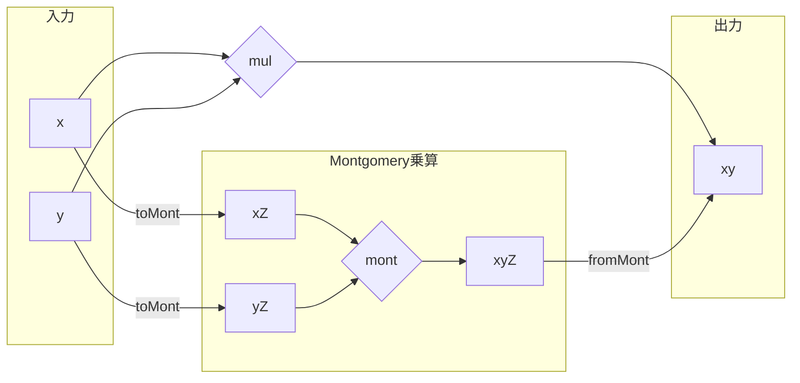

## 初めに

[前回](https://zenn.dev/herumi/articles/finite-field-03-mul)はMontgomery乗算を紹介しました。
今回はこれをどう利用するかとC++での実装の話をします。
Montgomery乗算は普通の乗算の代わりとなる重要な演算です。
記事全体の一覧は[有限体の実装一覧](https://zenn.dev/herumi/articles/finite-field-01-add#%E6%9C%89%E9%99%90%E4%BD%93%E3%81%AE%E5%AE%9F%E8%A3%85%E4%B8%80%E8%A6%A7)参照。

## 記号の復習
$p$は$N$ 個の`uint64_t`で表現できる素数, $M=2^{64}$, $M' M - p' p = 1$ となる整数 $0 < M' < p$, $0 < p' < M$ を選んでおく。
$Z = M^N \bmod{p}$, $Z' = M'^N \bmod{p}$ とする。$Z Z' \equiv = 1 \pmod{p}$ である。

## 通常の乗算からMontgomery乗算への移行
素数 $p$ の有限体の元 $x$, $y$ についてのMontgomery乗算とは

$$
mont(x, y) = x y Z' \bmod{p}
$$
となる演算でした。

前回、長々とmont(x, y)の説明をしましたが、これがどう役に立つのでしょうか。
煩雑なので ${}\bmod{p}$ を省略すると mont(x, y) = x y Z' なのでx, yの代わりにx Z, y Zを入力すると、mont(x Z, y Z) = (x Z)(y Z)Z' = x y Z となります。
つまり $x$, $y$ の代わりに $x Z$, $y Z$ を考えると、その世界でMontgomery乗算は普通の乗算に対応します。
Montgomeryの世界に入る対応 $x \mapsto x Z \bmod{p}$ を toMont(x) := mont(x, Z^2) = x (Z^2) Z' = x Zとします。
逆に戻ってくる対応 $x Z \mapsto x$ は fromMont(xZ) := mont(xZ, 1) = (xZ) 1 Z' = x です。

```python
def toMont(self, x):
  return self.mul(x, self.Z2)
def fromMont(self, x):
  return self.mul(x, 1)
```

これによりmul(x, y) = $xy \bmod{p}$ をfromMont(mont(toMont(x), toMont(y)))と書き換えられます。



もちろんこれだけなら素直に $xy \bmod{p}$ を計算する方が楽です。しかし、montは線型なので
- toMont(x) + toMont(y) = toMont(x + y)
- toMont(x) - toMont(y) = toMont(x - y)
なども成立します。
したがって、一度Montgomeryの世界に移行し、加減乗算をしばらく実行してから最後に戻ってくることにすれば効率のよい計算ができます。

## C++によるmontの実装
前回はPythonによる実装を紹介したので
