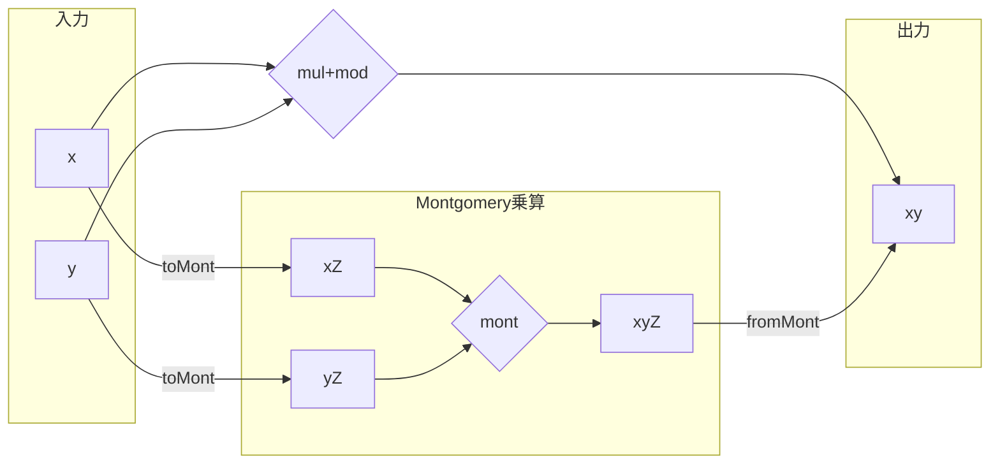

## 初めに

[前回](https://zenn.dev/herumi/articles/finite-field-03-mul)はMontgomery乗算を紹介しました。
今回はこれをどう利用するかとC++での実装の話をします。
記事全体の一覧は[有限体の実装一覧](https://zenn.dev/herumi/articles/finite-field-01-add#%E6%9C%89%E9%99%90%E4%BD%93%E3%81%AE%E5%AE%9F%E8%A3%85%E4%B8%80%E8%A6%A7)参照。

## 記号の復習
$p$は$N$ 個の`uint64_t`で表現できる素数, $M=2^{64}$, $M' M - p' p = 1$ となる整数 $0 < M' < p$, $0 < p' < M$ を選んでおく。
$Z = M^N \bmod{p}$, $Z' = M'^N \bmod{p}$ とする。$Z Z' \equiv = 1 \pmod{p}$ である。

## 通常の乗算からMontgomery乗算への移行
素数 $p$ の有限体の元 $x$, $y$ についてのMontgomery乗算とは

$$
mont(x, y) = x y Z' \bmod{p}
$$
となる演算でした。

前回、長々とmont(x, y)の説明をしましたが、これがどう役に立つのでしょうか。
煩雑なので ${}\bmod{p}$ を省略すると mont(x, y) = x y Z' なのでx, yの代わりにx Z, y Zを入力すると、mont(x Z, y Z) = (x Z)(y Z)Z' = x y Z となります。
つまり $x$, $y$ の代わりに $x Z$, $y Z$ を考えると、その世界でMontgomery乗算は普通の乗算に対応します。
Montgomeryの世界に入る対応 $x \mapsto x Z \bmod{p}$ を toMont(x) := mont(x, Z^2) = x (Z^2) Z' = x Zとします。
逆に戻ってくる対応 $x Z \mapsto x$ は fromMont(xZ) := mont(xZ, 1) = (xZ) 1 Z' = x です。

```python
def toMont(self, x):
  return self.mul(x, self.Z2)
def fromMont(self, x):
  return self.mul(x, 1)
```

これによりmul(x, y) = $xy \bmod{p}$ をfromMont(mont(toMont(x), toMont(y)))と書き換えられます。



もちろんこれだけなら素直に $xy \bmod{p}$ を計算する方が楽です。しかし、montは線型なので
- toMont(x) + toMont(y) = toMont(x + y)
- toMont(x) - toMont(y) = toMont(x - y)
なども成立します。
したがって、入力段階で一度Montgomeryの世界に移行し、必要な加減乗算をしばらく実行してから最後に戻ってくれば効率のよい計算ができます。

## C++によるmontの実装
前回はPythonによる実装を紹介したので今回はC++による実装を紹介します。

```python
# Pythonによる実装（再掲）
def mont(x, y):
  MASK = 2**L - 1
  t = 0
  for i in range(N):
    t += x * ((y >> (L * i)) & MASK) # (A)
    q = ((t & MASK) * self.ip) & MASK # (B)
    t += q * self.p # (C)
    t >>= L # (D)
  if t >= self.p: # (E)
    t -= self.p
  return t
```

Pythonコードの(A)や(C)はどちらもN桁×1桁をN桁に足し混む操作なので、[mulUnitAdd](https://zenn.dev/herumi/articles/bitint-07-gen-asm#mulunitadd%E3%81%AE%E5%A0%B4%E5%90%88)を利用できます。
ここでtの値は最大2p-1になりえることに注意します（前回の(E)の正当性を確認するところ）。
pがN * 64ビットの素数の場合2p-1はN * 64 + 1ビットになる場合があるので、その場合はmulUnitAddが使えません。
ただしBLS12-381などのペアリングで使われる素数は381ビットで2p-1はN * 64ビットに収まります｡
そこで[pがフルビットでない場合の最適化](https://zenn.dev/herumi/articles/finite-field-02-sub#p%E3%81%8C%E3%83%95%E3%83%AB%E3%83%93%E3%83%83%E3%83%88%E3%81%A7%E3%81%AA%E3%81%84%E5%A0%B4%E5%90%88%E3%81%AE%E6%9C%80%E9%81%A9%E5%8C%96)で紹介したように、pがフルビットかそうでないかによってmontの処理を変えます。
煩雑なので、ここではフルビットでない場合のコードを紹介します。

```cpp
# C++による実装
template<size_t N>
static void mulMontNFT(Unit *z, const Unit *x, const Unit *y, const Unit *p)
{
    const Unit rp = p[-1]; // p'に相当
    Unit buf[N * 2]; // tに相当
    buf[N] = bint::mulUnitT<N>(buf, x, y[0]); // ループ初回の(A)
    Unit q = buf[0] * rp; // ループ初回の(B)
    buf[N] += bint::mulUnitAddT<N>(buf, p, q); // ループ初回の(C)
    for (size_t i = 1; i < N; i++) {
        buf[N + i] = bint::mulUnitAddT<N>(buf + i, x, y[i]); // (A)
        q = buf[i] * rp; // (B)
        buf[N + i] += bint::mulUnitAddT<N>(buf + i, p, q); // (C)
    }
    if (bint::subT<N>(z, buf + N, p)) { // (E)
        bint::copyT<N>(z, buf + N);
    }
}
```
ループ初回はt = 0に加算するのでadd処理をスキップして直接mulUnitを呼び出します。
tに相当する変数はbuf[N * 2]と2倍のサイズを確保しておきます。(C)で加算したあと、buf[]をシフトする代わりにアクセスする添え字をずらせば(buf + i)、(D)のLだけ右シフトしたのと同じです。
pがフルビットの場合は繰り上がり処理がやや複雑になりますが同様にできます(see mulMontT)。

## まとめ
Montgomery乗算を使って通常の世界とMontgomery乗算がやりやすい世界との移行の話をしました。それからPythonコードに相当するC++コードも紹介しました。
次回はLLVMを使ったM1 Mac用の実装を紹介します。