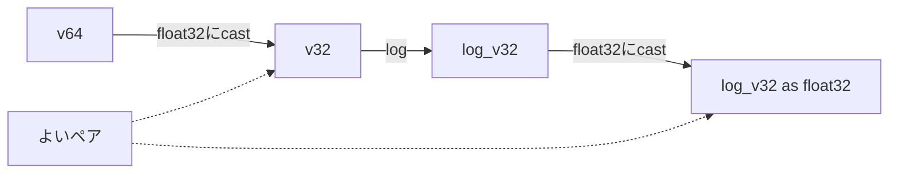
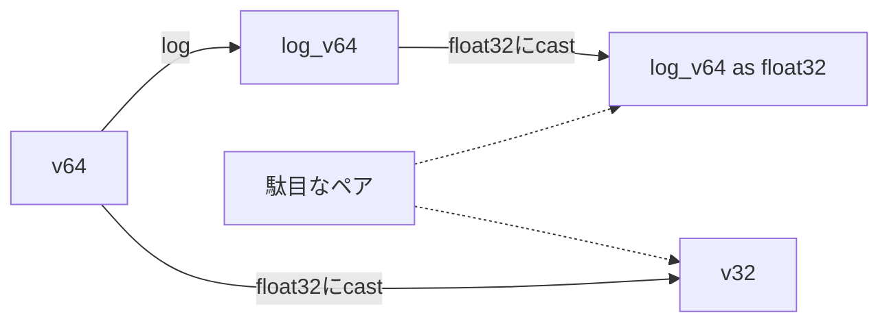

## 初めに
先日、[fmath](https://github.com/herumi/fmath)の`log(x)`関数を[Xbyak](https://github.com/herumi/xbyak)(C++)から[s_xbyak](https://github.com/herumi/s_xbyak/)(Python)で書き直しているときに、少し不思議な現象に出会いました。s_xbyakで書き直すと演算精度が少し悪くなってしまったのです。
もちろん最初は移植ミスを疑ったのですが、調べても生成コードに問題はありません。よく調べると関数が参照するテーブルがC++とPythonとで少し異なる値になっていたためでした。
その解決方法は、途中であえて精度を落として計算するという珍しいパターンだったので紹介します。

## 原因となったコード
実装した`log(x)`は次のtbl1, tbl2を参照します。

```cpp
#include <math.h>
#include <stdint.h>
#include <memory.h>

// uint32_tのビットパターンをfloat32として解釈する
float u2f(uint32_t u)
{
    float f;
    memcpy(&f, &u, 4);
    return f;
}

uint32_t f2u(float f)
{
    uint32_t u;
    memcpy(&u, &f, 4);
    return u;
}

int main()
{
    float tbl1[16], tbl2[16];
    for (int i = 0; i < 16; i++) {
        uint32_t u = (127u << 23) | ((i*2+1) << (23-4-1));
        float v = 1 / u2f(u);
        tbl1[i] = v;
        tbl2[i] = log(v);
    }
}
```
ASMコード生成時に、ある特定の値とそのlogのペア`(v, log(v))`を計算してテーブルに保持します。なぜこのような値が必要かは本題から外れるのでここでは触れません。

このテーブル生成コードを素直にPythonに持ってきました。
Pythonで`u2f`に相当するコードは`struct`を使いました。

```python
def u2f(u):
    return struct.unpack('>f', v.to_bytes(4,byteorder='big'))[0]

def f2u(f):
    return int(struct.pack('>f', v).hex(),16)

for i in range(16):
      u = (127 << 23) | ((i*2+1) << (23-4-1))
      v = 1 / u2f(u)
      tbl1.append(v)
      tbl2.append(math.log(v))
```

## 出力結果

tbl1, tbl2の値は最終的にはCのfloatのバイト表現に変換してASMから利用します。
C++とPythonの出力結果はtbl1は同じでしたがtbl2は少し異なりました。

i|C++|Python
-|-|-
 0|0xbcfc14c8|  0xbcfc14d8
 1|0xbdb78694|0xbdb78694
 2|0xbe14aa96|0xbe14aa98
 3|0xbe4a92d4|0xbe4a92d5
 4|0xbe7dc8c6| 0xbe7dc8c3
 5|0xbe974716|0xbe974716
 6|0xbeae8ded|0xbeae8dee
 7|0xbec4d19d|0xbec4d19c
 8|0xbeda27bd|0xbeda27bc
 9|0xbeeea34f| 0xbeeea350
10|0xbf012a95|0xbf012a95
11|0xbf0aa61f| 0xbf0aa61f
12|0xbf13caf0| 0xbf13caf1
13|0xbf1c9f07| 0xbf1c9f07
14|0xbf2527c4|0xbf2527c3
15|0xbf2d6a01|0xbf2d6a02

## 原因

察しのよい方はタイトルから既に見当がついていると思いますが、原因はPythonのfloatがCのdoubleであることに起因します。
ここではCのdoubleとfloatとPythonのfloatが出てきてややこしいので、32ビットの浮動小数点数をfloat32、64bitの浮動小数点数をfloat64と表記します。

型名|float32|float64
-|-|-
ビット長|32|64
言語の型|Cのfloat|Cのdouble = Pythonのfloat

Cでは
```cpp
    float v = 1 / u2f(u);
    tbl1[i] = v;
    tbl2[i] = log(v);
```
を全てfloat32で計算するのですが、Pythonでは

```python
      u = (127 << 23) | ((i*2+1) << (23-4-1))
      v = 1 / u2f(u)
      tbl1.append(v)
      tbl2.append(math.log(v))
```
の`u2f(u)`の結果はfloat32の精度だけれども`v`はfloat64になります。
今回のアルゴリズムで必要なのは`v`に対する正確なfloat32での`log(v)`でした。
しかし、float64の`v`に対する`log(v)`を求めてから`v`をfloat32にすると、その丸め誤差がテーブルを利用する側の計算に悪影響を与えたのです。

C++のコード


Pythonの元の悪いコード


## 対策
というわけで`v`をfloat32に変換すればよいのです。しかしPythonにはfloat32は無いので`v = u2f(f2u(v))`とすることでfloat64をfloat32に丸めた状態を作りました。

```python
  v = 1 / u2f(u)
  v = u2f(f2u(v)) # float32に精度を落とす
  tbl1.append(v)
  tbl2.append(math.log(v))
```
この1行を追加することでC++と同じテーブルが作成され、本来の`log(x)`の結果もC++版と完全一致しました。
なお、`numpy`には`float32`という型があるので、上記1行は`v = numpy.float32(v)`としても構いません。今回は極力標準でないライブラリは使いたくなかったのと、速度は不要だったので`struct`を使いました。

## まとめ
float64ではなくfloat32で計算しないと逆に精度が落ちてしまう場面があることと、Pythonでfloat32の値に変換する方法を紹介しました。
