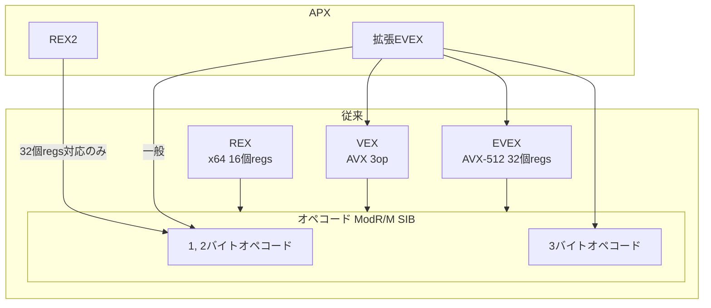

## 初めに
前回、[Intel APXの解説（エンコーディング編）](https://zenn.dev/herumi/articles/intel-apx-architecture)でAPXの機能を紹介しました。
今回はそれらの命令がどのようにエンコードされているかを紹介します。
8086からの屋上屋を重ねるかのような、（しかし後方互換性のために必要だった）拡張の歴史を80386から眺めてみましょう。

## 命令フォーマット
まずはAPX以前のx86, (IA-32), x64 (Intel 64)の命令フォーマットを軽く復習します。
命令フォーマットは次の形をとります。

プレフィクス|オペコード|ModR/M|SIB|オフセット (displacement)|即値
-|-|-|-|-|-
1~4バイト|1~3バイト|1バイト|1バイト|1~4バイト|1~8バイト

オペコードが必須、それ以外はオペランドなどに依存します。

## オペコード
命令本体を表すバイト列です。8086からあるaddやxorなどの基本的な命令は1バイト、条件分岐などの少数の命令が2バイト、その後3バイトのものが登場しました。
今から考えると1バイト命令を贅沢に使ってしまい、かつ後方互換性を守るために（多少崩れてますが）多バイト命令が増えてしまったのは残念です。
2バイト命令は「0x0F ○」、3バイト命令は「0x0F38 ○」「0x0F3A ○」という形をとります。

## ModR/MとSIB
オペランドの形が「reg, reg」や「reg, [reg+disp]」を表すModR/Mと「reg, [base+index*scale+disp]」を表すSIBがあります。ここで登場するregはインデックスが0から7までの8種類、3ビットしかありません。詳細は多数の参考書があるのでここでは省略します。
SIBが2個のレジスタをとるために、`mov reg, [base+index]`で実質3オペランドと同じレジスタのビット情報が必要なことに注意してください。
64ビット化のときにメモリアドレッシングは`[reg+disp]`の形しかとらないことにして3オペランド対応する手もあったのかもしれません。

## プレフィクス
プレフィクスは主に命令の動作を微調整するためにあります。しかし元の意味が消えて転用されているのが殆どです。
たとえばAES復号命令`aesdec`は`0x66 0F38 DE`と、0x66がついてますが、16ビット化とは無関係です。

- 0x66 : オペランドサイズ変更（つけると16ビット化 or それ以外の用途も）
- 0x67 : アドレスサイズ変更
- 0xF2, 0xF3 : 元は繰り返し命令のためだが、もはやそれ以外の用途がメイン
- lockプレフィクス (0xF0), rep系, セグメントオーバーライドなど

更に、
- REXプレフィクス (0x40~0x4Fのどれかの1バイト)
- VEXプレフィクス (0xC4から始まる2バイトVEX2 or 0xC5から始まる3バイトVEX3)
- EVEXプレフィクス (0x62から始まる4バイト)
があります。

### REXプレフィクス
REXプレフィクスはx64登場時に、レジスタサイズの指定 (32 or 64)と16個のレジスタを表現するために規定されました。
上位4ビットが0x4で固定、下位4ビットにサイズ指定ビットw、3種類のレジスタ(r, w, b)それぞれのインデックスが8以上かを表すビットに使われます。

7|6|5|4|3|2|1|0
-|-|-|-|-|-|-|-
0|1|0|0|REX.w|REX.r|REX.x|REX.b

REXプレフィクスは0x66や0xF2などの他のプレフィクスの前に置いて使います。

### VEXプレフィクス
VEXプレフィクスはAVX登場時に、3オペランドを表現するために規定されました。2バイトのVEX2、3バイトのVEX3があります。
0x66, 0xF2, 0xF3などのプレフィクスや、複数バイトオペコードの0x0F, 0x0F38, 0x0F3Aだけで何バイトも取るのは無駄なので、VEXプレフィクスの中に数ビットの形で押し込むようになりました。

### EVEXプレフィクス
EVEXプレフィクスはAVX-512登場時に、32個のSIMDレジスタを表現するために規定されました。他にも、様々なフラグ拡張がなされていますが詳細は[AVX-512（フォーマット）詳解](https://www.slideshare.net/herumi/avx512)など参照。プレフィクスの方がオペコードより長いのが悲しいですね。

## APX
準備が整ったところで本題です。APXは2種類のプレフィクスが規定されています。一つはREX2プレフィクスで、殆どの1 or 2バイトオペコードに付与して32個のレジスタを表現します。
もう一つはEVEX拡張で、従来の（legacyな）オペコード、VEX、従来のEVEXをそれぞれ拡張します。

*プレフィクスの関係図*

### REX2プレフィクス
REX2プレフィクスは次の2バイトの形です。REXと異なり、1, 2バイトオペコードのみにつきます。

*REX2プレフィクス*
0xD5|M0:R4:X4:B4:REXプレフィクスの下位4ビット
-|-

0xD5の次に、上位4ビットが「1 or 2バイトオペコードの区別を表すM0」「レジスタx, b, rのインデックスの4ビット目」を表し、下位4ビットが従来のREXプレフィクスの下位4ビットを表します。

### 拡張EVEX

*従来のEVEX*

0x62|P0|P1|P2
-|-|-|-

P0|R|X|B|R|0|m|m|m
-|-|-|-|-|-|-|-|-
P1|W|v|v|v|v|1|p|p
P2|z|L|L|b|v'|a|a|a

