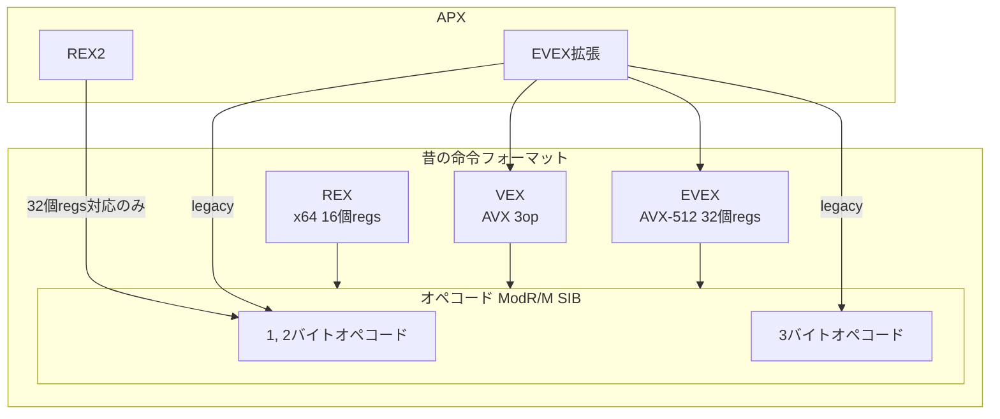

## 初めに
前回、[Intel APXの解説（エンコーディング編）](https://zenn.dev/herumi/articles/intel-apx-architecture)でAPXの機能を紹介しました。
今回はそれらの命令がどのようにエンコードされているかを紹介します。
8086からの屋上屋を重ねるかのような、（しかし後方互換性のために必要だった）拡張の歴史を80386から眺めてみましょう。

## 命令フォーマット
まずはAPX以前のx86, (IA-32), x64 (Intel 64)の命令フォーマットを軽く復習します。
命令フォーマットは次の形をとります。

*命令フォーマット*
プレフィクス|オペコード|ModR/M|SIB|オフセット (displacement)|即値
-|-|-|-|-|-
1~4バイト|1~3バイト|1バイト|1バイト|1~4バイト|1~8バイト

オペコードが必須、それ以外はオペランドなどに依存して追加されます。

## オペコード
命令本体を表すバイト列です。8086からあるaddやxorなどの基本的な命令は1バイト、条件分岐などの少数の命令が2バイト、その後3バイトのものが登場しました。
今から考えると1バイト命令を贅沢に使ってしまい、かつ後方互換性を守るために（多少崩れてますが）多バイト命令が増えてしまったのは残念です。
2バイト命令は「0x0F ○」、3バイト命令は「0x0F38 ○」または「0x0F3A ○」という形をとります。

## ModR/MとSIB
オペランドの形が「reg, reg」や「reg, [reg+disp]」を表すModR/Mと「reg, [base+index*scale+disp]」を表すSIBがあります。ここで登場するregはインデックスが0から7までの8種類、3ビットしかありません。詳細は多数の参考書があるのでここでは省略します。
SIBが2個のレジスタをとるために、`mov reg, [base+index]`で実質3オペランドと同じレジスタのビット情報が必要なことに注意してください。

## プレフィクス
プレフィクスは主に命令の動作を微調整するためにあります。しかし元の意味が消えて転用されているのが殆どです。たとえばAES復号命令`aesdec`は`0x66 0F38 DE`と、0x66がついてますが、16ビット化とは無関係です。

- 0x66 : オペランドサイズ変更（つけると16ビット化 or それ以外の用途も）
- 0x67 : アドレスサイズ変更
- 0xF2, 0xF3 : 元は繰り返し命令のためだが、もはやそれ以外の用途がメイン
- lockプレフィクス (0xF0), rep系, セグメントオーバーライドなど

更に、
- REXプレフィクス (0x40~0x4Fのどれかの1バイト)
- VEXプレフィクス (0xC4から始まる2バイトVEX2 or 0xC5から始まる3バイトVEX3)
- EVEXプレフィクス (0x62から始まる4バイト)
があります。

### REXプレフィクス
REXプレフィクスはx64登場時に、レジスタサイズの指定 (32 or 64)と16個のレジスタを表現するために規定されました。
上位4ビットが0x4で固定、下位4ビットにサイズ指定ビットw、3種類のレジスタ(r, w, b)それぞれのインデックスの3ビット目を表します。

*REXプレフィクス*
7|6|5|4|3|2|1|0
-|-|-|-|-|-|-|-
0|1|0|0|w|R3|X3|B3

REXプレフィクスは0x66や0xF2などの他のプレフィクスとオペコードの間に置きます。

### VEXプレフィクス
VEXプレフィクスはAVX登場時に、3オペランドを表現するために規定されました。2バイトのVEX2、3バイトのVEX3があります。
0x66, 0xF2, 0xF3などのプレフィクスや、複数バイトオペコードの0x0F, 0x0F38, 0x0F3Aだけで何バイトも取るのは無駄なので、VEXプレフィクスの中に数ビットの形で押し込むようになりました。

### EVEXプレフィクス
EVEXプレフィクスはAVX-512登場時に、32個のSIMDレジスタを表現するために規定されました。他にも、様々なフラグ拡張がなされていますが詳細は[AVX-512（フォーマット）詳解](https://www.slideshare.net/herumi/avx512)など参照。プレフィクスの方がオペコードより長いのが悲しいですね。

## APX
準備が整ったところで本題です。APXは2種類のプレフィクスが規定されています。一つはREX2プレフィクスで、殆どの1 or 2バイトオペコードに付与して32個のレジスタを表現します。
もう一つはEVEX拡張で、従来の（legacyな）オペコード、VEX、従来のEVEXをそれぞれ拡張します。

*プレフィクスの関係図*


### REX2プレフィクス
REX2プレフィクスは次の2バイトの形です。REXと異なり、1, 2バイトオペコードのみにつくことに注意してください（ややこしい）。

*REX2プレフィクス*
ビット|7~4|3~0
-|-|-
0xD5|M0:R4:X4:B4|REXプレフィクスの下位4ビット

先頭が0xD5で、次に上位4ビットが「1 or 2バイトオペコードの区別を表すM0」「レジスタx, b, rのインデックスの4ビット目」を表し、下位4ビットが従来のREXプレフィクスの下位4ビットを表します。

### EVEX拡張
従来のEVEXは次の形をとりました。先頭が0x62で次に、P0, P1 P2の3バイトが続きます。

*従来のEVEX*

バイト|0|1|2
-|-|-|-
0x62|P0|P1|P2

ビット|7|6|5|4|3|2|1|0
-|-|-|-|-|-|-|-|-
P0|R|X|B|R'|0|m|m|m
P1|W|v|v|v|v|1|p|p
P2|z|L|L|b|v'|a|a|a

このEVEXをEVEX拡張して

*EVEX拡張*
ビット|7|6|5|4|3|2|1|0
-|-|-|-|-|-|-|-|-
P0|R3|X3|B3|R4|B4|m|m|m
P1|W|v3|v2|v1|v0|X4|p|p
P2|z|L|L|b/ND|v4|a/NF|a|a

と、いくつかビットが固定だった部分が可変になりました。
[m:m:m]の部分(map)は、プレフィクスが0x0F → 1, 0x0F38 → 2, 0x0F3A → 3だったのもに加えて1バイトオペコードは4に設定されています。

プレフィクスの関係図で示した矢印それぞれでEVEX拡張方法が定められていて、大きく

1. VEX/EVEXでない従来のlegacy命令のEVEX拡張
2. VEXのEVEX拡張
3. EVEXのEVEX拡張

があります。「EVEXのEVEX拡張」なんて、何言っとんねん?って感じですが（英語ではEVEX extension of EVEX instructions）、それぞれ微妙にフラグの仕様が異なっています。たとえばmap4ではz = L = 0になるなど細かいルールは仕様書を参照してください。ccmpやctestのEVEX拡張もまた微妙に違うフラグです。
ややこし過ぎてIntel自身も初版のマニュアルではccmp/ctestのNDのフラグの表記を間違ってました（Xbyakの実装中にはまった）。

ここではAPXで二つ特徴的なフラグNDとNFだけ紹介しておきましょう。

NDは3オペランドになるフラグで、ND=1ならデスティネーションレジスタNDDのインデックスを[v4:v3:v2:v1:v0]で設定します。
NFはeflagsを更新するか否かを表すフラグで、NF=1なら更新しません。前回[フラグ更新抑制](https://zenn.dev/herumi/articles/intel-apx-architecture#%E3%83%95%E3%83%A9%E3%82%B0%E6%9B%B4%E6%96%B0%E6%8A%91%E5%88%B6)で紹介したXbyakの`T_nf`を指定するとNF=1になります。

### 命令長
EVEX拡張は4バイトもあるので、メモリオフセットが32ビットで即値も32ビットの命令だと命令長の上限15バイトに達してしまいます。
EVEX拡張(4) + オペコード(1) + ModR/M(1) + SIB(1) + disp(4) + imm(4) = 15
たとえば

```cpp
add(r30, ptr[r20+r21*8+0x12345678], 0xaabbccdd);
```

は
```
62FC8810 81 84 EC 78563412 DDCCBBAA
```
です。多用すると今までにもまして命令デコーダが追いつかなさそうですね。

ちなみに同じAPXでもREX2で表現できるなら、その方が命令長が短いのでお得です。

```
D55D01F5                 add r29, r30
624C941001F5             add r29, r29, r30
```

このようなフォーマットのデコーダ開発者は大変だなあと思いをはせてみるのもよいかもしれません。
