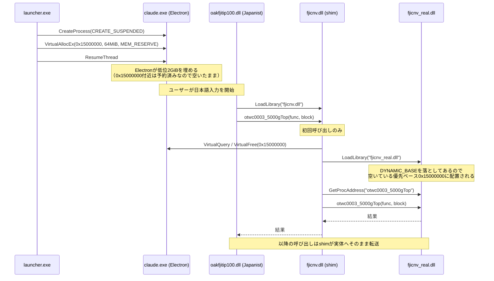

## はじめに
2026年8月初頭からWindowsのMicrosoft Edge上で日本語IMEのJapanist 10を使うと落ちるようになりました。Chromeも同様に落ちます。9月中頃にはClaude Desktopでも落ちるようになりました。
Japanist 10は2026年6月に[サポート終了](https://247ps-i.isnet.jp.fujitsu.com/platform/pc/information/20200519/)してしまったので使うなという話ではありますが、長年使っているとなかなかそういうわけにも行きません。
というわけでいろいろ不便なので対策をいくつか紹介します。
ただし全ては自己責任でお願いします。

## 原因
そもそも落ちる原因は、Japanist の変換エンジン fjicnv.dllにあります。クラッシュダンプをみると内部にポインタを32ビットとして扱うコードを含んでいるようです（詳細は追ってません）。
2GiB未満のアドレスにDLLがロードされていれば大丈夫だったのですが、Edge 151から低位の4GiBアドレス空間を予約するようになり、その問題が顕在化しました。

## Edge/ChromeでJapanistを使う
DLLを2GiB未満に配置できればとりあえず動きます。そのために実行ファイルを高エントロピーではなく低エントロピーのASLRで動かすようにします。

そのためには管理者権限でPowerShellを開いて

```ps
Start-Process pwsh -Verb RunAs -ArgumentList '-Command','Set-ProcessMitigation -Name msedge.exe -Disable HighEntropy'
Start-Process pwsh -Verb RunAs -ArgumentList '-Command','Set-ProcessMitigation -Name chrome.exe -Disable HighEntropy'
```

と入力します。HighEntropyをDisableにしてもイメージ ASLR、DEP、CFG等は有効です。
ただエントロピーが19ビットから8ビットに減るので攻撃されるリスクは若干リスクはあがります。それを念頭においてください。
元に戻すときはDisableをEnableにして実行します。

2026年10月現在は、こうするとJapanistで変換できるようになります。ただ将来も動作し続けるかは全く不明です。
ASLRのエントロピーを減らしたくないという方は後半を読んでください。

## Claude DesktopでJapanistを使う
こちらは前節の方法を使っても動きませんでした。Claude Desktopが利用しているElectronが2GiB以下の領域を使ってしまうからのようです。
それなら、exeをsuspend状態で起動し、JapanistのDLLを2GiB未満に配置してからresumeすればなんとかならないか、というアイデアの元に対策したのが次の方法です。
なかなかややこしい手順ですが、DLLの中身は見ずにできたのでよかったです。2週間ほどClaude Desktopを使って問題なく動作しています。
なお、こちらも当然ですがバージョンアップである日突然使えなくなることはありえますのでご注意ください。

### やり方
1. [Visual Studio Community 18](https://visualstudio.microsoft.com/ja/free-developer-offers/)をinstallします。
生成物をGitHubに置いてもよいのですがダウンロード時に多分ブロックされてしまうのでご自身でビルドしてください。

**追記** launcher.exeとダミーのfjicnv.dll(shim)を追加したのでVisual Studioをインストールしなくても大丈夫かもしれません。
が、実行時にブロックされたら、やはりご自身でビルドしてください。

2. `C:\Program Files\Japanist10\x64\CMD`は通常ユーザーには書き込み権限がないので、管理者権限のコマンドプロンプトで次を実行して書き込めるようにします。

```bat
icacls "C:\Program Files\Japanist10\x64\CMD" /grant "%USERNAME%:(M)"
```

3. Visual Studioのコマンドプロンプトを開き[herumi/blog](https://github.com/herumi/blog/)をcloneして[blog/src/japanist](https://github.com/herumi/blog/tree/main/src/japanist)に移動します。

```bat
git clone https://github.com/herumi/blog
cd blog/src/japanist
```

4. `build.bat`を実行すると`launcher.exe`とダミーの`fjicnv.dll`ができます。

5. `patch_dll.ps1`を実行します。

```bat
powershell -ExecutionPolicy Bypass -File patch_dll.ps1
```

すると`Japanist10\x64\CMD\fjicnv.dll`が`src/japanist`にコピーされてDYNAMIC_BASEフラグを落としたファイル`fjicnv_real.dll`ができます。


6. 最後に`install.ps1`をPowerShell上で実行します。

```bat
powershell -ExecutionPolicy Bypass -File install.ps1
```

で`C:\Program Files\Japanist10\x64\CMD`の中身を差し替えます。元の`fjicnv.dll`を`fjicnv.dll.suspendbak`に退避し、`fjicnv.dll`をダミー（shim）に置き換え、`fjicnv_real.dll`を隣に置きます。
これで準備が終わりました。

### 起動
**Claude Desktopアプリを完全に終了した状態**で`launcher.exe`を起動するとClaude Desktopが起動します。Japanistが使えることを確認してください。
以降はClaude Desktop本体の代わりに`launcher.exe`を使います。利用中にClaude Desktopが更新されて自動起動した場合は**launcher経由でないのでJapanistを使おうとすると落ちます**。一度終了してからlauncherを実行してください。

ダミーの`fjicnv.dll`はlauncher経由でないプロセスでは単に`fjicnv_real.dll`をロードして呼び出しを転送するだけなので、Edgeやその他のアプリのJapanistには影響しません。

### 元に戻す

```bat
powershell -ExecutionPolicy Bypass -File uninstall.ps1
```

で退避した`fjicnv.dll`を戻し、`fjicnv_real.dll`を削除します。手動である場合は次の2行と同じです。

```bat
copy /y "C:\Program Files\Japanist10\x64\CMD\fjicnv.dll.suspendbak" "C:\Program Files\Japanist10\x64\CMD\fjicnv.dll"
del "C:\Program Files\Japanist10\x64\CMD\fjicnv_real.dll"
```

`C:\Program Files\Japanist10\x64\CMD`に付けた書き込み権限を戻すには

```bat
icacls "C:\Program Files\Japanist10\x64\CMD" /remove "%USERNAME%"
```

としてください。

## 内容概略
仕組みを図にすると次のようになります。



- `launcher.exe`はClaude Desktopをsuspend状態で起動し、Electronがアドレス空間を埋める前に`fjicnv.dll`の優先ベース`0x15000000`を予約してから再開します。launcherの仕事はこれだけで、起動後はすぐ終了します。
- `fjicnv.dll`（shim）は本来の`fjicnv.dll`と同じ場所に置かれる差し込みDLLで、exportしているのは`otwc0003_5000gTop`だけです。初回に呼ばれたときに予約した領域を解放し、直後に`fjicnv_real.dll`をロードします。
- `fjicnv_real.dll`は本来の`fjicnv.dll`からDYNAMIC_BASE（ASLR）フラグを落としたコピーです。フラグが無いので、空いていれば必ず優先ベース`0x15000000`に配置され、2GiB未満の条件を満たします。
- （launcher経由でない）一般のプロセスは予約が無いので、shimは単に`fjicnv_real.dll`をロードして転送するだけです。

## 追記
Edge/Chromeで低エントロピー設定をしたくない人はClaude Desktopと同じ方法でできるようにしました。
`launcher.exe [edge|chrome]`とオプションを指定して起動するとHighEntropyのままでもJapanistを使えます(2026/10/1現在)。
ただし、`chrome://settings/system`を開いて「Google Chrome を閉じた際にバックグラウンドアプリの処理を続行する」をoffにしておかないとlauncher経由になりません。
また、Chromeを起動していないときにURLをクリックして開いてもlauncher経由になりません。
デスクトップに置いたChromeのアイコンやタスクバーのピンを`launcher.exe chrome`などにするとよいでしょう。
