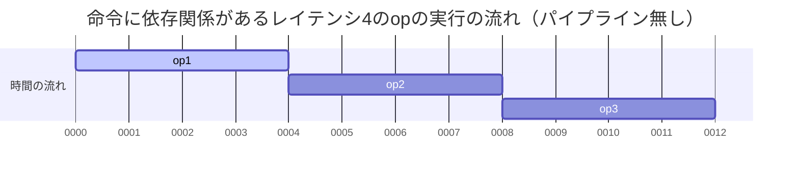
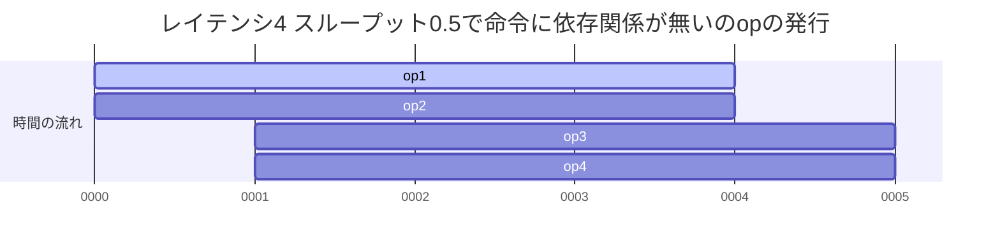
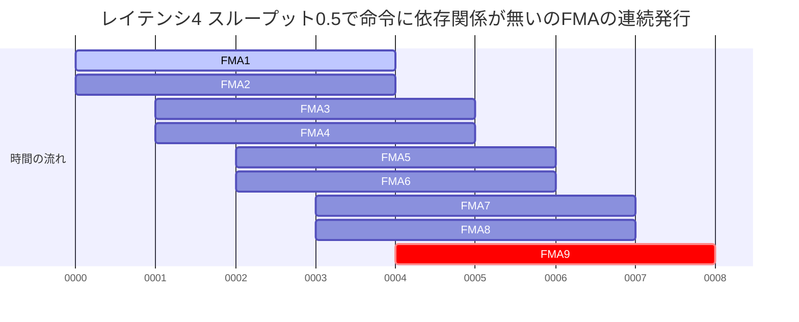

## 初めに
ここではIntel CPUのレイテンシとスループットの基本を解説し、FMAの処理時間を調べます。

## レイテンシとスループット
### レイテンシ
CPUにおけるレイテンシ(latency)とは命令が発行されてからその実行が完了するまでの時間（クロックサイクル）です。
たとえばレイテンシが4なら実行されてから4クロックサイクル（以降clkと記す）後にその結果を利用できます。



### スループット
Intelのマニュアルによるとスループットとは同じ命令を続けて発行するときに待つclkです。たとえばスループットが1なら1clkごとに1命令、0.5なら1clkごとに2命令同時に発行できます。



ただし、通常スループットというと単位時間あたりに処理できる量を表し、大きいほど高性能です（Gbpsなど）。それに従うなら1clkあたりに同じ命令を何個発行できるかという定義になるべきであり、Intelのスループットは逆数(Reciprocal)スループットと表記されることがあります（下記Agner Fogさんの資料など）。
スループットがどちらの意味で使われてるかは文脈で判断してください。この記事ではIntelの定義に従います。

Intel CPUの命令ごとのレイテンシやスループットはたとえば次の資料に記載されています。
- [agner.orgのinstruction tables](https://www.agner.org/optimize/instruction_tables.pdf)
- [Intelのマニュアル](https://www.intel.com/content/www/us/en/developer/articles/technical/intel-sdm.html)
- [uops](https://uops.info/)

## FMA
FMA(Fused Multiply -Add)とは $x \times y + z$ を計算する命令群です。たとえばAVX-512で32個のfloatの $x \leftarrow x \times y + z$ は`vfmadd213ps x, y, z`です。
Cascade LakeやSkylake-XではFMAはレイテンシ4 スループット0.5です。
単純ループでベンチマークを取ってみましょう（[テストコード](https://github.com/herumi/misc/tree/main/fma)）。

次のコード`gen_func(n)`は`n`を指定するとそれだけ命令を並べてループさせる関数を生成します。

```python
def gen_func(n):
  with FuncProc(f'func{n}'):
    with StackFrame(1, vNum=n+1, vType=T_ZMM) as sf:
      c = sf.p[0]
      lp = Label()
      for i in range(n):
        vxorps(Zmm(i), Zmm(i), Zmm(i))
      align(32)
      L(lp)
      for i in range(n):
        vfmadd231ps(Zmm(i), Zmm(i), Zmm(i))
      sub(c, 1)
      jnz(lp)
```

`n` = 1のときに生成されたコードです。

```asm
func1:
vxorps zmm0, zmm0, zmm0
align 32
@L1:
vfmadd231ps zmm0, zmm0, zmm0
sub rdi, 1
jnz @L1
ret
```

Turbo Boostをoffにしてベンチマークをとります。

```sh
sudo sh -c "echo 1 > /sys/devices/system/cpu/intel_pstate/no_turbo"
```

すると1ループあたり約4.1clkとなりました。`sub` + `jnz`は別ポートで実行されるのでここでは無視するとFMAが4clkで処理されています。
演算結果`zmm0`が次のFMAの入力になっているので、レイテンシ4が直列に実行されているのです。
ループ内で互いに入力が依存しないFMAを増やしてみましょう。

```asm
// n = 2
@L1:
vfmadd231ps zmm0, zmm0, zmm0
vfmadd231ps zmm1, zmm1, zmm1
sub rdi, 1
jnz @L1
ret

...

// N = 8
@L8:
vfmadd231ps zmm0, zmm0, zmm0
vfmadd231ps zmm1, zmm1, zmm1
vfmadd231ps zmm2, zmm2, zmm2
vfmadd231ps zmm3, zmm3, zmm3
vfmadd231ps zmm4, zmm4, zmm4
vfmadd231ps zmm5, zmm5, zmm5
vfmadd231ps zmm6, zmm6, zmm6
vfmadd231ps zmm7, zmm7, zmm7
sub rdi, 1
jnz @L8
```

全てのFMAが1個ずつシーケンシャルにしか実行できないなら、命令数を増やすと実行時間は線形に増えるはずです。しかし、実行結果はn=8までほぼ4clkのままでした。

`n`を増やしたときの1ループあたりの処理時間

n|1|2|3|4|5|6|7|8|9|10
-|-|-|-|-|-|-|-|-|-|-
clk|4.1|4.0|4.0|4.0|4.0|4.0|4.0|4.0|4.5|5.0|5.50

これはまさに「レイテンシ4 スループット0.5」を意味します。1clkごとに2命令発行し、4clk後にその値を利用できるからです。



FMA1, FMA2, ...と順次発行して、FMA1の結果が求まる`0004`のところでFMA9がその結果を利用する場合、隙間が全くありません。最も効率がよいことになります。
n = 8を越えると、待機するFMAが増えるのでその分遅くなっていきます。

## まとめ
CPUのレイテンシとスループットの用語を紹介し、FMAの速度を測って、その意味を確認しました。次回は多項式の評価例を紹介します。
