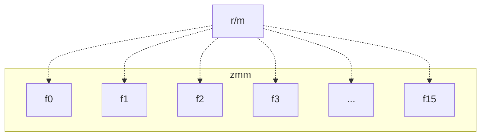

## 初めに
ここではAVX-512のFMAを使って小さい次数の多項式の評価する方法を考察します。

## 多項式の評価
$f(x)$ を $n$ 次の実数係数多項式とします。

$$ f(x) = a_0 + a_1 x + a_2 x^2 + \cdots + a_n x^n.$$

多項式の評価とは $x=x_0$ のときの $f(x_0)$ を求めることです。
演算回数を減らすには後ろから求めるのがよいです。たとえば $n=4$ のときは

$$ f(x) = a_0 + x(a_1 + x(a_2 + x(a_3 + x a_4))) $$

と変形できるので、$t \leftarrow a_4$ として
1. $t \leftarrow a_3 + x t$
2. $t \leftarrow a_2 + x t$
3. $t \leftarrow a_1 + x t$
4. $t \leftarrow a_0 + x t$
として計算できます。

$a_i + xt$ の部分は前回[CPUのレイテンシとスループット](https://zenn.dev/herumi/articles/latency-throughput#fma)で紹介したFMAを使えます。

FMA(x, y, z) : $x \leftarrow x + y z$

## ループアンロール
多項式 $f(x)$ が固定で、大量の $x$ について評価したい場合、AVX-512のFMAを使って高速化できます。
前回紹介したようにSkylake-XなどでのFMAはレイテンシ4 スループット0.5です。オペランドがメモリの場合は理論値より遅くなりますが、8回アンロールするのが望ましいです。

しかし、8回もアンロールすると（他の処理に必要な）レジスタが足りなくなるかもしれません。係数は固定なのでレジスタではなくメモリに置いておいてもL1キャッシュにヒットしてそれほど遅くはならないと思われます。係数を設定するにはいくつか方法が考えられます。

### vpbroadcastdを使う

`vpbroadcastd(z, r/m)`は`r/m`の32bitの値をzmmレジスタに16個コピーする命令です。



メモリから設定する方法と汎用レジスタに設定して読み込む方法の2通りが考えられます。

```python
vpbroadcast(zmm0, ptr(rip+addr))
```

```python
mov(eax, 即値)
vpbroadcast(zmm0, eax)
```
なんとなく後者の方がメモリを介さないので速いのかなという印象でした。

### `ptr_b`を使う

FMAの3番目のオペランドはbroadcast指定ができるので直接メモリを指定します。`ptr_b`は`vpbroadcastd`相当の動作をします。
（注意）`ptr_b`は[s_xbyak](https://github.com/herumi/s_xbyak/#avx-512)の表記です。[自動的に'{1toX}'に変換されます](https://zenn.dev/herumi/articles/s_xbyak-assembler-1#%E3%83%96%E3%83%AD%E3%83%BC%E3%83%89%E3%82%AD%E3%83%A3%E3%82%B9%E3%83%88)。

```python
vfmadd231ps(zmm0, zmm1, ptr_b(rip+addr))
```

ループアンロールしたときはその回数だけ`ptr_b`が並ぶと遅そうです。それよりは一度だけvpbroadcastdを使ってFMAだけアンロールする方がアンロール回数が多いときはよさそうに思います（思ってました）。

## ベンチマーク

実際にこの3通りを比較しましょう。[gen.py](https://github.com/herumi/misc/blob/main/fma/gen.py)でアンロール回数と生成パターンを変えて試してみました。

全部レジスタ（のN=4のときのコード）
```asm
.L4:
vfmadd231ps %zmm0, %zmm0, %zmm0
vfmadd231ps %zmm1, %zmm1, %zmm1
vfmadd231ps %zmm2, %zmm2, %zmm2
vfmadd231ps %zmm3, %zmm3, %zmm3
sub $1, %rdi
jnz .L4
```

最初にvpbroadcastdしてそれを利用（のN=4のときのコード）
```asm
.L4:
mov $291, %rax
vpbroadcastd %eax, %zmm4
vfmadd231ps %zmm4, %zmm0, %zmm0
vfmadd231ps %zmm4, %zmm1, %zmm1
vfmadd231ps %zmm4, %zmm2, %zmm2
vfmadd231ps %zmm4, %zmm3, %zmm3
sub $1, %rdi
jnz .L4
```

それぞれptr_b（のN=4のときのコード）
```asm
.L4:
vfmadd231ps (%rax){1to16}, %zmm0, %zmm0
vfmadd231ps 4(%rax){1to16}, %zmm1, %zmm1
vfmadd231ps 8(%rax){1to16}, %zmm2, %zmm2
vfmadd231ps 12(%rax){1to16}, %zmm3, %zmm3
sub $1, %rdi
jnz .L4
```

Xeon Platinum 8280 Turbo Boost off (clk)
N|1|2|3|4|5|6|7|8|9
-|-|-|-|-|-|-|-|-|-
全部レジスタ|4.13|4.02|4.00|4.00|4.00|4.00|4.00|4.00|4.57
最初にvpbroadcastd|4.13|4.01|4.00|4.00|4.00|4.06|4.22|4.74|5.25
それぞれptr_b|4.14|4.01|4.00|4.00|4.00|4.00|4.06|4.38|4.97

予想に反してN = 8のときはそれぞれptr_bしたほうがvpbroadcastd一度して使い回すより速いです。必要なレジスタも減らせるので積極的に`ptr_b`を使うのがよさそうです。
（注意）差は微小なので、メモリアクセス状況にも依存するでしょうから、実際にベンチマークして評価するのがよいでしょう。レジスタが余っているなら載せる方がよいです。

## まとめ
AVX-512のFMAを使った多項式評価の方法を紹介しました。
多項式の係数はレジスタに載せられるならその方がよいですが、ループアンロールするならFMA+`ptr_b`を検討するとよいでしょう。
