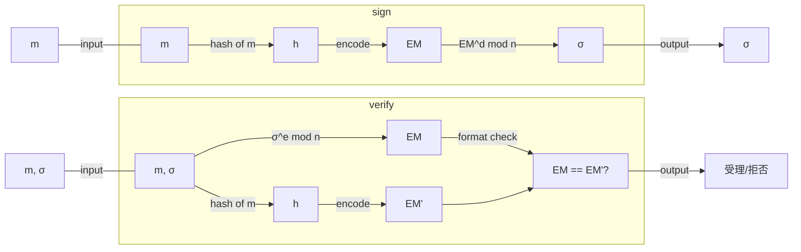

## 初めに

「署名とはメッセージのハッシュ値を秘密鍵で暗号化（or 復号）したものであり、検証は署名を公開鍵で復号（or 暗号化）してハッシュ値と等しいかを確認すること」という説明(×)をよく見かけます。
正しい署名の定義と実際のRSA署名がどのようなものであり、上記説明(×)がなぜよくないのかを理解しましょう。

## 署名の定義

署名の解説は[署名の概要](https://zenn.dev/herumi/articles/sd202203-ecc-2#%E7%BD%B2%E5%90%8D%E3%81%AE%E6%A6%82%E8%A6%81)でも解説しましたが、再掲します。
署名は鍵生成、署名（sign）、検証（verify）の3個のアルゴリズムからなります。
鍵生成ではアリスが署名鍵sと検証鍵Sを生成します。署名鍵sは自分だけの秘密の値なので秘密鍵、検証鍵Sは他人に渡して使ってもらう鍵なので公開鍵ともいいます。
signは署名したいデータmに対して署名鍵sで署名と呼ばれるデータσを作ります。
データmと署名σのペアを他人（ボブ）に渡します。
verifyはボブが検証鍵Sを使って(m,σ)の正しさを確認し、受理か拒否します。

*署名*

署名はデータを秘匿するための暗号化とは独立な概念です。歴史的な背景に触れるのでなければ、RSA暗号化の関数の特殊性を用いた説明は避けるべきでしょう。
[RFC 8017](https://www.rfc-editor.org/rfc/rfc8017)ではRSAを署名に使うときは暗号化・復号という言葉を使わずRSASP(Signature Primitive)とRSAVP(Verification Primitive)を使っています。
普及が進んでいる[ECDSA](https://zenn.dev/herumi/articles/sd202203-ecc-2#ecdsa%E3%81%AE%E9%8D%B5%E7%94%9F%E6%88%90)やEdDSA、Ethereumなどで使われるBLS署名も説明(×)とは異なる方法です。

たとえ話をすると（だから突っ込み所はあるでしょうが）、説明(×)は自動車の定義を聞かれて「自動車とは牛に引かれて動く車」と牛車の説明をしているようなものです。なぜ一般論の中で限定した古い話をしているの?というわけです。自動車の動力はガソリン、電気、ハイブリッド、水素など多様なものがあるのですから「自動車とは人力以外の力で動く車」とすべきでしょう。

## RSAの基礎

まず記号をいくつか準備します。
- pとqを素数、n = pqとします。
- dとeをde - 1が(p-1)(q-1)で割り切れる整数とします（1<d, e<n）。
- $f(x, y) = y^x$ mod nとします（mod nはnで割った余り）。

このとき0以上n未満の整数mに対してc = f(e, m) = $m^e$ mod nとするとf(d, c) = $c^d$ mod n = mが成り立ちます。
十分大きく適切なpとqを選び、nとeが公開された状態で、任意のmについてだれでもcを計算できます。しかし逆にcからmを求めることはできません。このような関数を一方向性といいます。
しかし、dを知っている人だけは逆向きの計算ができます。このような性質を持つ$f(x, y)$を落とし戸つき一方向性関数といいます。
Enc(m) = f(e, m)として暗号化に落とし戸つき一方向性関数を利用するのがRSA暗号の肝です。復号Dec(c) = f(d, c)がEnc(m)と同じ関数fで表せるのはRSA暗号の特徴です。このときe（とn）を公開鍵、dを秘密鍵として利用しています。

*RSAの落とし戸つき一方向性関数（『暗認本』p.122）*

話はそれますが大抵の入門書に載っているこの「RSA暗号」は安全ではないので絶対に使ってはいけません。たとえば0や1の暗号文は0や1のままです。より詳しい理由は[『暗認本』](https://herumi.github.io/anninbon/)などをごらんください。実際にはもっと複雑な方式が使われます。
なお、掛け算とmodは交換できるのでEnc(mm') = Enc(m)Enc(m')という性質があります。

## Full domain hash(FDH)のRSA署名

RSAの落とし戸つき一方向性関数を署名に使った方式の一つがfull domain hashのRSA署名です。

- 鍵生成 : RSAの基礎のp, q, d, eを選ぶ。dが署名鍵、(n, e)が検証鍵である。
- mの署名 : ハッシュ関数Hashを使ってh = Hash(m)を計算し、σ=f(d, h)を署名とする。
- (m, σ)の検証 : h = Hash(m)とh' = f(e, σ)を計算し、h = h'なら受理、そうでなければ拒否する。

*FDHのRSA署名*

この方式を元にして、署名のことを「説明(×)」と解説しているものが多いと想像します。

ところでタイトルの「full domain hash」とはなんでしょうか。これはハッシュ値の範囲が0以上n未満全体となりえるようなハッシュ関数という意味です。2048ビットRSAなら2048ビット値のハッシュ関数です。普通使うSHA-256は256ビットのハッシュ関数なのでFDHはずいぶん大きいですね。FDHのRSA署名は安全であることが示されていますが、ハッシュ関数としてSHA-256などを使った場合の安全性証明はありません。

実際1985年にDesmedtとOdlyzkoが小さいハッシュ関数を使ったときの攻撃方法を提案しています。恐らく「説明(×)」においてハッシュ関数がFDHであることを念頭には置いていないと思われるので、安全とはいえないRSA署名の解説をしていることになります。

## アドホックな改良とRSASSA-PKCS1-v1_5

FDHのRSA署名には安全性証明がありますが、大きなハッシュ関数を使うので効率がよくありません。そこでFDHではない普通のハッシュ関数にデータをエンコードしてつかう方法がいくつか提案されています。エンコードとはハッシュ値の前後に適当なデータを追加して調整する方法です。
アドホックに対応するので安全性が心配なところがあります。実際ISO/IEC 9796(-2)などは標準化された後で攻撃が見つかりました。その中で[RSASSA-PKCS1-v1_5](https://datatracker.ietf.org/doc/html/rfc8017#section-8-2)は今のところ有力な攻撃方法が見つかっていないため広く使われています。ただし安全性証明はありません。
この方式はハッシュ値hを求めたら、hの前に`0x00||0x01||0xf...f||0x00||ID`（IDはある固定バイト列）をつけてEMとし、σ=f(d, EM)とします。

*RSASSA-PKCS1-v1_5の署名(sign)と検証(verify)*

## RSASSA-PSS

メモ
RSA-PSS RFC-8017 https://www.rfc-editor.org/rfc/rfc8017
RSASSA-PKCS1-v1_5

RSA-OAEP

ECDSA, EdDSA, 格子を使った署名

RSA-PSS
input : key, msg

p, q : 素数
n = pq
d : RSA秘密鍵
e : RSA公開鍵(ed ≡ 1 mod (p-1)(q-1)となる整数)

rsaEncryption識別子というのは

以下p, q(とn)を固定します。

f(x, m) = m^x mod n

RSAEP : RSA Encryption primitiveの略
RSADP : RSA Decryption primitiveの略

RSAEP(e, m) = f(e, m)
RSADP(d, m) = f(d, m)
RSAEPとRSADPの違いはfの第一引数にeを入れるかdを入れるかの違い

RSASP1(d, m) = f(d, m)
RSAVP1(e, m) = f(e, m)

RSASP1 = RSADP
RSAVP1 = RSAEP
ではありますが、暗号化と署名は用とが異なるので区別するために名前がつけられています。

RSA-PSS

sign(d, m)

EMCA-PSS-ENCODE(M)
mHash = Hash(M)

M' = 0...0 || mHash || salt
H = Hash(M')
DB = 0..0 || 1 || salt
dbMask = MGF(H)

maskedDB = DB xor dbMask
EM = 0...0 || maskedDB || H || 0xbc
output EM

EMSA-PSS-VERIFY(M, EM)
mHash = Hash(M)
dbMask = MGF(H)
DB = maskedDB xor dbMask
salt = truncate(DB)
M' = 0...0 || mHash || salt
H' = Hash(M')
return H == H'

MGF(seed)
T = ""
counter = 0
T = T || Hash(seed || counter)
truncate(T)
