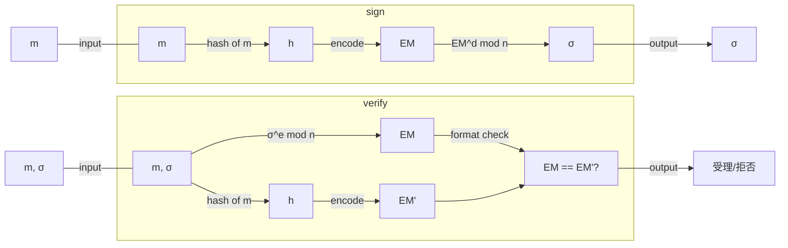

## 初めに

「署名とはメッセージのハッシュ値を秘密鍵で暗号化したものであり、検証は署名を公開鍵で復号してハッシュ値と等しいかを確認することである」という説明(×)をよく見かけます。
正しい署名の定義と実際のRSA署名がどのようなものであり、上記説明(×)がなぜよくないのかを理解しましょう。

## 署名の定義

署名の解説は[署名の概要](https://zenn.dev/herumi/articles/sd202203-ecc-2#%E7%BD%B2%E5%90%8D%E3%81%AE%E6%A6%82%E8%A6%81)でも解説しましたが、再掲します。
署名（方式）は鍵生成（KeyGen）、署名（Sign）、検証（Verify）の3個のアルゴリズムからなります。
KeyGenではアリスが署名鍵sと検証鍵Sを生成します。署名鍵sは自分だけの秘密の値なので秘密鍵、検証鍵Sは他人に渡して使ってもらう鍵なので公開鍵ともいいます。
Signは署名したいデータmに対して署名鍵sを使って署名と呼ばれるデータσを作ります。
データmと署名σのペアを他人（ボブ）に渡します。
Verifyはボブが検証鍵Sを使って(m,σ)の正しさを確認し、受理か拒否します。

*署名*
安全な署名方式は、攻撃者がアリスの署名をたくさん集めても、アリスが署名したことの無いデータに対する署名を作れません。

署名はデータを秘匿するための暗号化とは独立な概念です。歴史的な背景に触れるのでなければ、RSA暗号化の関数の特殊性を用いた説明は避けるべきでしょう。
普及が進んでいる[ECDSA](https://zenn.dev/herumi/articles/sd202203-ecc-2#ecdsa%E3%81%AE%E9%8D%B5%E7%94%9F%E6%88%90)やEdDSA、Ethereumなどで使われる[BLS署名](https://zenn.dev/herumi/articles/bls-signature)も説明(×)とは異なる方法です。

たとえ話をすると（だから突っ込み所はあるでしょうが）、説明(×)は一般的な自動車の定義を聞かれたときに「自動車とは牛に引かれて動く車である」と大昔の牛車の説明をしているようなものです。自動車の動力はガソリン、電気、ハイブリッド、水素など多様なものがあるのですから「自動車とは人力以外の力で動く車である」とすべきでしょう。

## RSAの基礎

まず記号をいくつか準備します。
- pとqを素数、n = pqとします。
- dとeをde - 1が(p-1)(q-1)で割り切れる整数とします（1<d, e<n）。
- $f(x, y) = y^x$ mod nとします（mod nはnで割った余り）。

このとき0以上n未満の整数mに対してc = f(e, m) = $m^e$ mod nとするとf(d, c) = $c^d$ mod n = mが成り立ちます。
十分大きく適切なpとqを選び、nとeが公開された状態で、任意のmについてだれでもcを計算できます。しかし逆にcからmを求めることはできません。このような関数を一方向性といいます。
しかし、dを知っている人だけは逆向きの計算ができます。このような性質を持つ$f(x, y)$を落とし戸つき一方向性関数といいます。
Enc(m) = f(e, m)として暗号化に落とし戸つき一方向性関数を利用するのがRSA暗号の肝です。復号Dec(c) = f(d, c)がEnc(m)と同じ関数fで表せるのはRSA暗号の特徴です。このときe（とn）を公開鍵、dを秘密鍵として利用しています。

*RSAの落とし戸つき一方向性関数（『暗認本』p.122）*

話はそれますが大抵の入門書に載っているこの「RSA暗号」は安全ではないので絶対に使ってはいけません。たとえば0や1の暗号文は0や1のままです。より詳しい理由は[『暗認本』](https://herumi.github.io/anninbon/)などをごらんください。実際にはもっと複雑な方式が使われます。
さて、RSAの暗号化と復号は
$$Dec(Enc(m)) = (m^e)^d \text{ mod } n = m$$
という性質を使いました。真ん中のべき乗はdとeを入れ換えても成り立ちます。[RFC 8017](https://www.rfc-editor.org/rfc/rfc8017)ではRSAを署名に使うときは用途が異なるので復号・暗号化の代わりにRSASP(Signature Primitive)とRSAVP(Verification Primitive)という言葉を使っています。
$$VP(SP(m)) = (m^d)^e \text{ mod } n = m$$
というわけです。この関係式を使うのがRSA署名の肝です。

なお、掛け算とmodは交換できるのでSP(mm') = SP(m)SP(m')という性質があります。これが後で紹介する署名の攻撃に使われます。

## Full Domain Hash(FDH)のRSA署名

RSAの落とし戸つき一方向性関数を署名に使った方式の一つがfull domain hashのRSA署名です。

- 鍵生成 : RSAの基礎のp, q, d, eを選ぶ。dが署名鍵、(n, e)が検証鍵である。
- mの署名 : ハッシュ関数Hashを使ってh = Hash(m)を計算し、σ = SP(h) = $h^d$ mod nを署名とする。
- (m, σ)の検証 : h = Hash(m)とh' = VP(σ) = $σ^e$ mod nを計算し、h = h'なら受理、そうでなければ拒否する。

*FDHのRSA署名*

この方式を元にして、署名のことを「説明(×)」と解説しているものが多いと想像します。

ところでタイトルの「full domain hash」とはなんでしょうか。これはハッシュ値の範囲が0以上n未満全体となりえるようなハッシュ関数という意味です。2048ビットRSAなら2048ビット値のハッシュ関数です。普通使うSHA-256は256ビットのハッシュ関数なのでFDHはずいぶん大きいですね。FDHのRSA署名は安全であることが示されていますが、ハッシュ関数としてSHA-256などを使った場合の安全性証明はありません。

実際1985年にDesmedtとOdlyzkoが小さいハッシュ関数を使ったときの攻撃方法を提案しています。恐らく「説明(×)」においてハッシュ関数がFDHであることを念頭には置いていないと思われるので、安全とはいえないRSA署名の説明をしていることになります。

## アドホックな改良とRSASSA-PKCS1-v1_5

FDHのRSA署名には安全性証明がありますが、大きなハッシュ関数を使うので効率がよくありません。そこで普通のハッシュ関数を使って作ったハッシュ値を適当に加工して使う方法（エンコード）がいろいろ提案されています。
エンコード方式はアドホックなものが多く、安全性が心配なところがあります。実際過去にISO/IEC 9796-2で標準化された後で攻撃が見つかったことがあります。その中で[RSASSA-PKCS1-v1_5](https://www.rfc-editor.org/rfc/rfc8017#section-8.2)は今のところ有力な攻撃方法が見つかっていないため広く使われています（SSAはSignature Scheme with Appendixの略）。ただし安全性証明はありません。
この方式はハッシュ値hを求めたら、hの前に`0x00||0x01||0xf...f||0x00||DI`（DIはある固定バイト列）をつけてEMとし、署名σ=$EM^d$ mod nとします（dは署名鍵）。
検証は$σ^e$ mod n = EMを求め、mから作ったEM'と比較して一致すれば受理します。

*RSASSA-PKCS1-v1_5の署名(sign)と検証(verify)*

## RSASSA-PSS
アドホックな改善ではなく、きちんと安全性証明がつけられた方式の一つが[RSASSA-PSS](https://www.rfc-editor.org/rfc/rfc8017#section-8.1)です。PSS方式はメッセージm以外にランダムなsaltを入力します。PSSはProbabilistic Signature Scheme（確率的署名方式）の略です。
PKCS1-v1_5方式はハッシュ値と固定値を連結していましたが、PSSではmとsaltごとに変わる値にします。そのためにMGF(Mask Generation Function)を使います。MGFは、固定長のハッシュ関数を使って入力値から長いハッシュ値を出力する関数です。

### RSASSA-PSSの署名
まずメッセージmのハッシュ値hを求め、saltと連結して再度ハッシュ値h'をとります。それからMGFを使ってmaskを作り、maskとsaltをxor（排他的論理和）してmaskedDBを作ります。maskedDBとh'を連結してEMという値を作り、署名$σ=EM^d$ mod nとします。

*RSASSA-PSSの署名*

### RSASSA-PSSの検証
メッセージmと署名σのペアを受け取ったら、mのハッシュ値hとEM = $σ^e$ mod nを計算します（eは検証鍵）。EMが正しい形であることをチェックしたら分解してmaskedDBとh'を取り出します。
h'からMGFを使ってmaskを作り、maskedDBとxorすることでDBを復元します。DBの形をチェックしてsaltを取り出します。最後にhとsaltから再度hashを取ってh''を作り、h' == h''だったら署名を受理します。
署名するときに入力したsaltをうまく復元して利用していますね。またPKCS1-v1_5と違って署名σだけからはh = Hash(m)を復元できない（だからメッセージのハッシュ値を比較することもできない）という特徴もあります。

*RSASSA-PSSの検証*

## まとめ
- （一般の）署名の概念は暗号化・復号とは独立に定義される。
- 安全なRSA署名はメッセージのハッシュ値を比較するような単純なものではない。
- 安全性証明があるRSASSA-PSS署名を使うのが推奨される。
