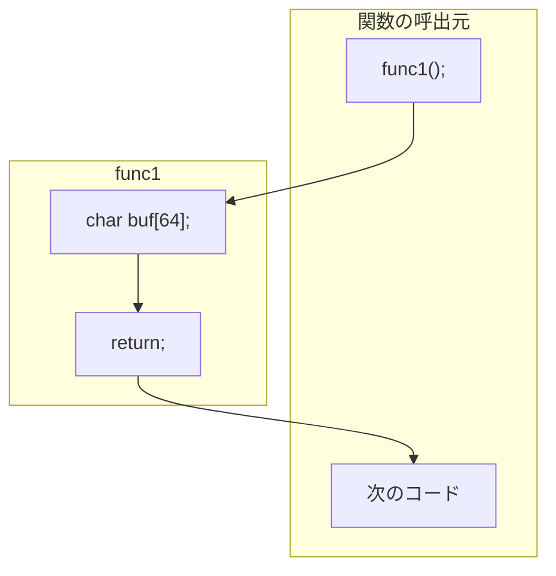

## 初めに
JavaScirptからWASMのスタックポインタをemscriptenの関数を用いて操作する方法を紹介します。

## スタックポインタ
ここで、スタックとは関数内で主に一時的に利用される変数のメモリ上における格納領域のことで、スタックポインタ（SP : stack pointer）はそのアドレスを指す識別子です。
モデルを単純化して説明すると、たとえば関数`func1`が呼び出され、`func1`の中で一時変数`char bu[64];`があると64バイト、スタックポインタSPを減らします。そして関数の処理が終わって呼出元に戻るときにSPを元の値に復元します。
実際には最適化により確保されなかったり、そのほかの変数と統合されたりすることがあります。従って通常SPを明示的に操作することはありません。

```cpp
func1: // 疑似コード
  SP -= 64; // char buf[64]の分を確保
  ... (func1の処理)
  SP += 64; // SPを元に戻す
  return;
```

*関数の呼び出し*


## mcl-wasmにおけるWASMとCとのやりとり
暗号ライブラリ[mcl-wasm](https://github.com/herumi/mcl-wasm)は有限体Fpや楕円曲線G1などのクラスのインスタンスは単なるバイト列で、メモリ管理はライブラリを呼び出す側で管理する方針で設計しています。

```typescript
abstract class Common {
  /** @internal */
  public a_: Uint32Array

  constructor (size: number) {
    this.a_ = new Uint32Array(size / 4)
  }
```
共通の基底クラス`Common`はUint32Arrayの配列`a_`を持ち、四則演算などの様々なメソッドは、`a_`を一端WASM側の関数`malloc`で確保したメモリにコピーしてから利用しています。

`Common`クラスのメモリ周りの操作メソッド
```typescript
  /** @internal alloc new array */
  _alloc (): number {
    return mod._malloc(this.a_.length * 4)
  }
  /** @internal alloc and copy a_ to mod.HEAP32[pos / 4] */
  _allocAndCopy (): number {
    const pos = this._alloc()
    mod.HEAP32.set(this.a_, pos / 4)
    return pos
  }
  /** @internal save pos to a_ */
  _save (pos: number): void {
    this.a_.set(mod.HEAP32.subarray(pos / 4, pos / 4 + this.a_.length))
  }
  /** @internal save and free */
  _saveAndFree (pos: number): void {
    this._save(pos)
    mod._free(pos)
  }
```
それぞれ次の操作をします。
- `_alloc` : 必要なサイズのメモリ確保
- `_allocAndCopy` : メモリ確保してから`a_`をコピー
- `save` : 対象メモリを`a_`にコピー
- `saveAndFree` : `a_`にコピーしてからfree

そして、たとえば有限体`Fp`のインスタンス`x`と`y`を足して結果`z`を返す関数は次のように実装しています。

```typescript
add(x : Fp, y : Fp) => Fp {
  const z = new Fp()
  const xPos = x._allocAndCopy() // xのメモリを確保して状態をコピー
  const yPos = y._allocAndCopy() // yのメモリを確保して状態をコピー
  const zPos = z._alloc() // zのメモリを確保
  mod._mclBnFpAdd(zPos, xPos, yPos) // xPosとyPosのメモリの値をaddしてzPosに書き込む
  z._saveAndFpee(zPos) // zPosの値をz_にコピーしてzPosをfree
  _free(yPos) // yPosをfree
  _free(xPos) // xPosをfree
  return z
}
```

毎回メモリ確保+コピー+開放の組み合わせはオーバーヘッドが大きいのですが、mallocしたポインタを使い回すのはデストラクタの無いJavaScriptと相性が悪いので利便性のためにこうしています。高速な処理をしたいときはJavaScript側でメモリ管理を自分で行い、ポインタを保持してダイレクトに操作することはできます。

## emccによるWASMのスタック操作

malloc/freeは汎用的なメモリ管理なので処理が重たいです。関数`add`の中で必要なx, y, zの領域は一時的に必要ですぐ開放するので本来なら（WASM側の）スタックで管理したいものです。
JavaScriptからemccで管理しているスタックを操作する関数が、StackSave, StackAlloc, StackRestoreです。それぞれ次の操作をします。

- StackSave : 現在のスタックポインタの値を返す。
- StackAlloc(n) : nバイトのスタックを確保してそのポインタを返す。
- StackRestore(sp) : スタックポインタをspの位置に戻す。

これらの関数の実体は[stack_ops.S](https://github.com/emscripten-core/emscripten/blob/main/system/lib/compiler-rt/stack_ops.S)にあります。
WASMで書かれていますがざっくりとCで表すとこんな実装です。

```C
uint8_t*__stack_pointer;
uint8_t *stackSave() { // 現在のSPを返す
  return __stack_pointer;
}
void stackRestore(uint8_t *sp) { // 指定したSPに設定する
  __stack_pointer = sp;
}
uint8_t* stackAlloc(size_t n) { // SPからnを引く（アライメント処理あり）
  __stack_pointer = (uint8_t*)((size_t(__stack_pointer) - n) & ~15ull); // 16バイトアライメント
  return __stack_pointer;
}
```

見ての通り、スタックポインタをダイレクトに操作しています。使い方を間違えるとさくっと落ちるので注意してください。

以前、Qiitaで記事を書いたときはこれらの関数はRuntimeに所属していたのですが、その直後のemccのバージョンアップでmodの直下に移動しました。
前回[exportする関数](https://zenn.dev/herumi/articles/wasm-emcc-option#export%E3%81%99%E3%82%8B%E9%96%A2%E6%95%B0)で紹介したように、デフォルトでは見えないのでコンパイル時に明示的にexportします。

```makefile
EMCC_OPT+=-sEXPORTED_FUNCTIONS=_malloc,_free,stackAlloc,stackSave,stackRestore
```

## malloc/freeの代わりにスタックを利用する
それではmalloc/freeの代わりにスタック操作関数を使ってみましょう。
`Common`クラスにスタックを確保`_salloc`、コピーする関数`_sallocAndCopy`を追加します。

```typescript
  /** @internal stack alloc new array */
  _salloc (): number {
    return mod.stackAlloc(this.a_.length * 4)
  }
  /** @internal stack alloc and copy a_ to mod.HEAP32[pos / 4] */
  _sallocAndCopy (): number {
    const pos = this._salloc()
    mod.HEAP32.set(this.a_, pos / 4)
    return pos
  }
```
これらの補助関数を使うと前述のaddは次のように記述できます。

```typescript
add(x : Fp, y : Fp) => Fp {
  const z = new Fp()
  const stack = mod.stackSave() // 現在のSPを取得
  const xPos = x._sallocAndCopy() // スタックに確保して状態をコピー
  const yPos = y._sallocAndCopy() // スタックに確保して状態をコピー
  const zPos = z._salloc() // スタックに確保
  mod._mclBnFpAdd(zPos, xPos, yPos)
  z._save(zPos) // 結果をzにコピー
  mod.stackRestore(stack) // スタックを元に戻す
  return z
}
```

いくつかの`free`操作がまとめられてstackRestore一つになっています。

## ベンチマーク
有限体Fpの四則演算の簡単なベンチマークをとってみました。環境はXeon 8280(Turbo boost off) + emcc 3.1.43 + Node.js v16.13.0です。

演算|malloc/free|stack(usec)
-|-|-
add|0.498|0.438
sub|0.489|0.418
mul|0.814|0.755
inv|9.287|9.209

変動はありますが、大体0.06~0.07usec処理が軽くなっているようです。addやsubは単体の処理が軽いので13%ぐらいの高速化です。意外と効果がありますね。

### まとめ
JavaScriptからWASMのスタックを操作する方法を紹介しました。あまり使う機会は無いかもしれませんが、一時用途にmalloc/freeを使っている場合は代替案として有効かもしれません。
