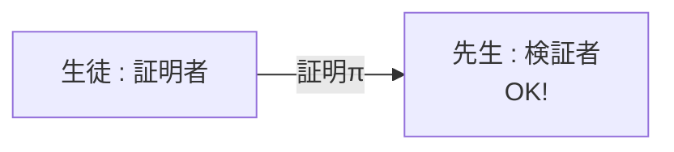
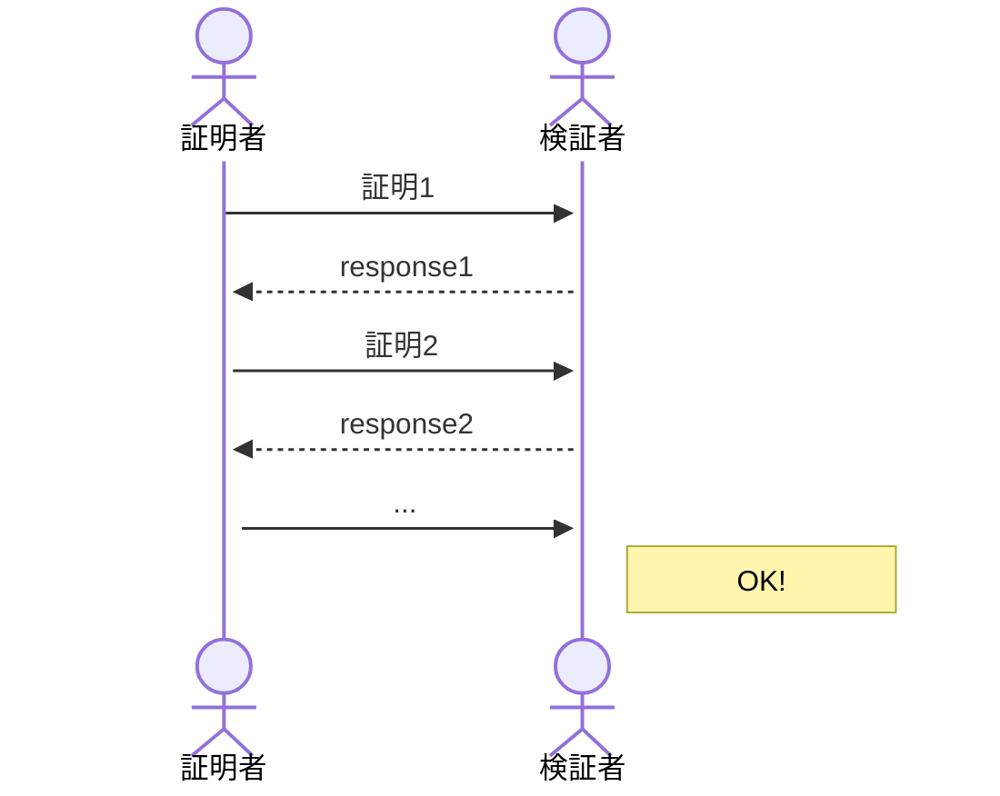

## 初めに
証明とは、ある命題（正しいかそうでないか判定できる文）が正しいことを相手に納得してもらう手続きです。
ゼロ知識証明ZKP(Zero Knowledge Proof)とは、その証明の手続きの最中に、相手が納得すること以外の情報を与えない（与えた知識がゼロ）という手法です。
概念自体が分かりにくいものですが、その性質を順を追って説明しましょう。

## 非対話証明と対話証明
たとえばテストで問題「三角形ABCにおいて角A=角Bのとき、この三角形は二等辺三角形であることを示せ」が出たとします。
この場合、問題が命題、生徒が証明者P(Prover)、生徒が書いた答えが証明π、先生が検証者V(Verifier)です。先生は答えがあってれば受理、そうでなければ拒絶します。
生徒から先生への情報提供は一度だけなので非対話証明といいます。これは普通の数学の証明ですね。

非対話証明

それに対して、対話証明とは何度も証明者と情報のやりとりをする形態です。一回の説明では納得できないので、不備を問い詰めていく感じでしょうか。

対話証明

一般的には、やりとりが一度で済む非対話証明が対話証明よりも効率的です。ただし、安全性証明の仮定が強くなることがあります。対話証明で構成し、それを非対話証明に変換する手続きがあります。
