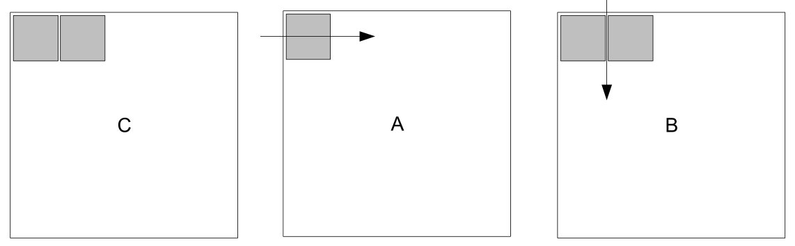

# AMX所感

「[Intel Architecture Instruction Set Extensions Programming Reference : 以下 AMXの仕様](https://software.intel.com/content/dam/develop/public/us/en/documents/architecture-instruction-set-extensions-programming-reference.pdf)」を眺めてみた。

まだざくっとしかみてないので間違ってるところ多いかも。

## 概要
- 行列演算をするための新しい枠組み。
  - AMX = Advanced Matrix EXtensions
- 64-bit環境専用(AVXは32-bit環境でも使えてた)。
- 8個の新しいレジスタtmm0, ..., tmm7(一つ1KiB)が追加された。
- 今のところbfloat16とint8専用([Intelの機械学習用命令](int8-bfloat16.md)参照)

## 用語
- タイル
  - 大きな2次元行列の部分行列
- TMUL(tile matrix multiply unit : タイル行列乗算ユニット)
  - タイルを操作するアクセラレータ
- パレット
  - タイルの操作モード?
  - パレット0
    - 初期状態
  - パレット1
    - 8個のレジスタtmm0, ..., tmm7で表される8KiBの領域(TILEDATA)
    - プログラマはより小さい次元に設定できる
  - TILECFG
    - タイル関連制御レジスタ
    - パレットの値とメタデータを保持する
  - アクセラレータを追加すると拡張できる
  - cpuidに示された最もよいパレットを使う

- AMXアーキテクチャ
  - ホストCPUがメモリブロックやループの回数、ポインタ操作などを設定
  - load/store/アクセラレータコマンドをTMULに送る
  - TMULがメモリ一貫性をもちながらホストのメモリとやりとりする
  - AVX-512と一緒に使える

- TILECFG
  - ldtilecfg ; メモリからデータを読む
  - sttilecfg ; メモリに書く
  - tilerelease ; タイルの初期化

## TMULアーキテクチャ
- cpuidが(TMULの?)最大高さ(tmul_maxk)と最大SIMDの次元(tmul_maxn)を返す

### `tileloadd tmm, ptr[membegin + stride]`
- tmmに部分行列を読み込む
  - membeginから始まる行列のtmm.rows分だけ読み込む(strideは次の列へのオフセット)
  - 設定された値を超えた部分は0で埋められる
  - tileloaddt1はデータキャッシュのヒントつきtileloadd
- メモリアドレッシングがsibmemという新しい方法
- これは常にSIB encodingを使うということ?
- `rax + rcx * 4`はそのポインタを表すのではなく
  - membegin = rax ; 先頭ポインタ
  - stride = rcx * 4 ; 次の列へのオフセット
  - membeginのi番目の列(`[membegin + strig * i]`)を意味する

### `tilestored`
- tmmを部分行列として書き出す

### `tilezero`
- タイルを0にする

### bfloat16の行列演算
- `tdpbf16ps t1, t2, t3`
- t2とt3のblfoat16としての積和演算(結果はfloat)をt1に足し込む

### int8の行列演算(結果はuint32)
- `tdpbssd` ; s8とs8の積和
- `tdpbsud` ; s8とu8の積和
- `tdpbusd` ; u8とs8の積和
- `tdpbuud` ; u8とu8の積和

○行列演算(C += AB) AMXの仕様 Figure 3-3より引用



行列のタイル計算の内側部分

```
TILELOADD tmm0, [rsi+rdi] // Cの読み込み(rsi ; Cの先頭ポインタ, rdi ; Cの次のラインへのオフセット)
TILELOADD tmm1, [rsi+rdi+N] // Cの隣(rsi + N)の読み込み
MOV r14, 0
lp:
  TILELOADD tmm2, [r8+r9] // Aの読み込み(r8 ; Aの先頭ポインタ, r9 ; Aの次のラインへのオフセット)
  TILELOADD tmm3, [r10+r11] // Bの読み込み(r10 ; Bの先頭ポインタ, r11 ; Bの次のラインへのオフセット)
  TDPBUSD tmm0, tmm2, tmm3 // u8成分のAとs8成分のBの行列計算してtmm0に足し込む
  TILELOADD tmm3, [r10+r11+N] // 隣のBの読み込み
  TDPBUSD tmm1, tmm2, tmm3 // Cの隣を更新
  ADD r8, K // 次のA
  ADD r10, K*r11
  ADD r14, K
  CMP r14, LIMIT
  JNE lp
TILESTORED [rsi+rdi], tmm0 // Cの更新
TILESTORED [rsi+rdi+M], tmm1 // 隣のCの更新
```
