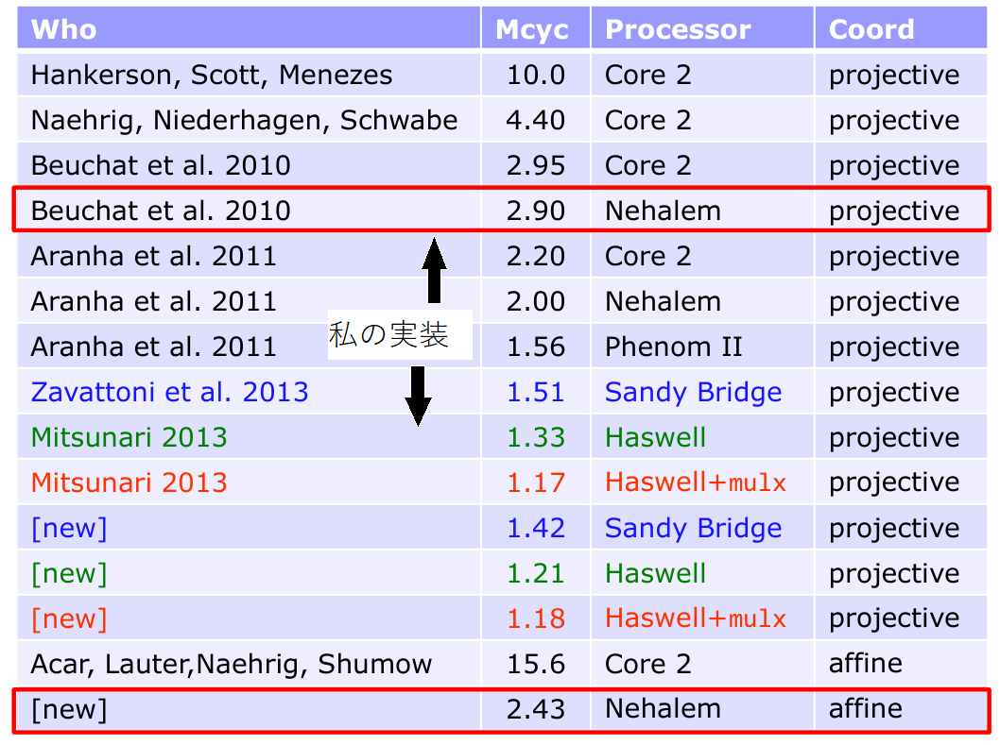
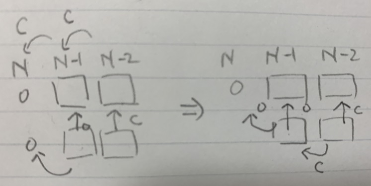

# ペアリング演算ライブラリ[mcl](https://github.com/herumi/mcl)の実装詳解

# 自分の実装歴史

- 2004 IPA未踏ソフトウェアで実装
- ~2008 η<sub>T</sub>ペアリング ; SIMDベース
- BN曲線の実装
- 
  - 図は[The Realm of the Pairings(SAC2013)](http://sac2013.irmacs.sfu.ca/slides/s1.pdf)
- 2015 [属性ベース暗号の実装](https://ieeexplore.ieee.org/document/6827966) IEEE trans. on computers
  - 上位アルゴリズムの若干の改良は進むが基礎体の実装はほとんど変化なし
- 2018 BLS12-381曲線の実装
  - 3年ぐらい最適化してない
  - ハッシュ関数の実装やwasm/Go/Rust対応などいろいろやること
- 2020 blstが登場(8%ほどmclより速い)
  - 現在最適化再開中
  - 基礎体の速度は抜いたかな

# 体演算

- p : 254 or 381bit素数
- 有限体 : Fp = Z/pZ = {0, 1, 2, ..., p-1}
- Fp2 = Fp[i] / (i^2 + 1) ; Fpの複素数版
  - x = a + bi where a, b in Fp., i^2=-1

# x64の基礎知識

実装は[fp_generator.hpp](https://github.com/herumi/mcl/blob/master/src/fp_generator.hpp)

## 256/382bit整数の表現
- N = 4 or 6
- 64bit整数をUnitと呼ぶことにする(ここだけの表現)
- x, y, z : N個のUnit
- little endian
- 例 x = [x3:x2:x1:x0], xiはUnit. x = x0 + (x1 << 64) + (x2 << 128) + (x3 << 192)

## 加算
- x = [x3:x2:x1:x0], y = [y3:y2:y1:y0]のとき
- 下位Unitから繰り上がりを考慮して足す

擬似コード
```
(z0, c) = x0 + y0, cは繰り上がりを表す1bitの情報(carry:以下CF)
(z1, c) = x1 + y1 + c
(z2, c) = x2 + y2 + c
(z3, c) = x3 + y3 + c
```

x64命令
- add x, y
  - x = x + y
  - update CF
- adc x, y
  - x = x + y + CF
  - update CF

上記擬似コードの実装

```
mov eax, ptr[x + 0 * 8]
add eax, ptr[y + 0 * 8]
mov ptr[z + 0 * 8], eax

mov eax, ptr[x + 1 * 8]
adc eax, ptr[y + 1 * 8]
mov ptr[z + 1 * 8], eax

mov eax, ptr[x + 2 * 8]
adc eax, ptr[y + 2 * 8]
mov ptr[z + 2 * 8], eax
...
```

## 減算
擬似コード

```
(z0, c) = x0 - y0, cは繰り下がり(borrow)を表す1bitの情報
(z1, c) = x1 - y1 - c
(z2, c) = x2 - y2 - c
(z3, c) = x3 - y3 - c
```

x64命令
- sub x, y
  - x = x - y
  - update CF
- sbb x, y
  - x = x - y - CF
  - update CF

上記擬似コードの実装

```
mov eax, ptr[x + 0 * 8]
sub eax, ptr[y + 0 * 8]
mov ptr[z + 0 * 8], eax

mov eax, ptr[x + 1 * 8]
sbb eax, ptr[y + 1 * 8]
mov ptr[z + 1 * 8], eax

mov eax, ptr[x + 2 * 8]
sbb eax, ptr[y + 2 * 8]
mov ptr[z + 2 * 8], eax
...
```

## N桁 x 1桁乗算

```
// Unit N個×Unit 1個(z[N + 1] = x[N] * y)
void mulUnit(Unit z[N + 1], const Unit x[N], Unit y);

   |x2|x1|x0|
x        | y|
-------------
       |x0*y|
    |x1*y|
 |x2*y|
----------
  ......
```

x64命令
- mul reg
  - `[rdx:eax]` = reg * eax
  - mul命令はフラグCFを破壊する
  - mulしながらadcはつかえない
  - x0*y, x1*y, x2*y, ...を全部計算してからadd, adcを使わないといけない
  - レジスタ数圧迫

- mulx H, L, reg
  - `[H:L]` = reg * rdx
  - mulxはフラグを変更しない
  - mulxしてadd/adcすれば一時レジスタは3個のまま計算できる

N = 4のときの例

4|3|2|1|0
-|-|-|-|-
-|-|-|t1|t0
-|-|t2|rax|-
-|x|rax|-|-
rdx|rax|-|-|-|

```
mov(rdx, y);
mulx(t1, t0, ptr [px + 8 * 0]);
mulx(t2, rax, ptr [px + 8 * 1]);
add(t1, rax);
mulx(x, rax, ptr [px + 8 * 2]);
adc(t2, rax);
mulx(rdx, rax, ptr [px + 8 * 3]);
adc(x, rax);
adc(rdx, 0);
```

## N桁 x N桁乗算

- 教科書的方法
- N桁 x 1桁を足していく

```
      |x2|x1|x0|
   x  |y2|y1|y0|
   -------------
      |x  *  y0|
   |x  *  y1|
|x  *  y2|
----------------
```
問題点
- `x * y0`のあと`x * y1`が完了するまで足せない
  - メモリに保存しないとレジスタ足りない

## adox, adcx
- CF ; carry flag
- OF ; overflow flag
- add, adc, sub, sbbはCFとOFの両方を変更

CFしか変更しないaddとOFしか変更しないadd
- adox x, y
  - x = x + y + OF
  - update OF
- adcx x, y
  - x = x + y + CF
  - update CF
- これらを使うとmulUnitしながら多倍長のaddができる

例
- mulxで作った[H:L]に対してLをadoxでHをadcxで足す
- それぞれのlineはOF, CFでcarryを伝達
- 最後のところでOFの帳尻を合わせる

```
// input  : t[4], x[3], y
// output : t[4] += x[3] * y
|t3|t2|t1|t0|
+
   |x2|x1|x0|
x          y
-------------
      |H0|L0| ; [H0:L0] ← x0 * y
   |H1|L1|    ; [H1:L1] ← x1 * y
|H2|L2|       ; [H2:L2] ← x2 * y

xor rax, rax ; CF, OFクリア
mov rdx, y
mulx H, L, ptr[x0]
adox t0, L
adcx t1, H
mulx H, L, ptr[x1]
adox t1, L
adcx t2, H
...
mulx H, L, ptr[x(n-1)]
adox t(n-1), L
adcx tn, H

mov rdx, 0
adcx tn, rdx
adox tn, rdx
```
- すごくきれいにn-Unit x n-Unit→2n-Unitを実現
- 最後の処理でもたつく
  - mulUnitしてから足すよりも1回加算が多い
- n = 4のときは使わない方が速かった
  - adcx, adoxはaddよりちょっと遅い
  - 全部adcx, adoxを使うよりaddが4回ある方がよい???
  - n = 6ではレジスタ退避・復元を考えると使った方がよいだろう

今回よく考えてみた

- W = 2^64
- (a W + b)cの最大値を考える
- ((W - 1)W + (W - 1))(W - 1) = (W^2 - 1)(W - 1) = W^3 - W^2 - W + 1 = W^3 - (W^2 + W - 1) < (W - 1)W^2
- つまり最上位Unitの値は <= W - 2
- 1bit足しても大丈夫



- 加算回数を1回減らせた

## Montgomery乗算
- 乗算したら2N桁になるので素数pで割らないといけない(有限体)
- この処理がとても重たい

- Montgomery還元
  - W = 2^64とする
  - R := (1 << (256 or 384)) % p
  - pとWは互いに素なので rp * p + a W = -1となる0 < rp < Wとaが存在する
  - mont(x) := x R mod p
  - montMul(x, y) := mont(xy)とする
    - montMul(x/R, y/R) = (x/R)(y/R) R = xy/R
* 「xとyを掛けてmod p」する代わりに[xRとyRのmontMulをするとxyRが得られる
* montMulはmod pよりはコストが低い
* xとxRの変換コストは高いが一度xRの世界に移行すれば最後の出力までxRのままで計算する
* xRはmont(x, R^2) = xR^2 R^(-1) = xRで計算できる

### montMulの擬似コード

```
// montMul(x, y);
// input  : x[n], y[n]
// output : z[n] = montMul(x[n], y[n])
z = 0
for (size_t i = 0; i < n; i++) {
  z += x * y[i];
  Unit q = z[0] * rp_;
  z += p_ * q;
  z >>= L; // L = 32 or 64
}
if (z >= p_) {
  z -= p_;
}
return z;
```

- これはxとyを掛けながらmontしてるがxyを求めてからmontしてもよい

```
 z = xy;
for (size_t i = 0; i < pn_; i++) {
  uint32_t q = z[0] * rp_;
  z += p_ * q;
  z >>= L;
}
if (z >= p_) {
  z -= p_;
}
```
これは2次拡大体F_p^2で有効

- x = a + bi, i^2 = -1
- y = c + di
- xy = (a + bi)(c + di) = (ac - bd) + (ad + bc)i

- 掛け算4回
- ad + bc = (a + b)(c + d) - ac - bdとすると掛け算3回

すなわち
```
t0 = a + b
t1 = c + d
ac = a * c
bd = b * d
z0 = ac - bd
z1 = t0 * t1 - ac - bd
```
- ac, bd, t0 * t1をmodをとらないで計算(出力は2N桁)
- ac - bd, t0 t1 - ac - bdを2N桁のままで計算したあとmodする
- modの回数が3回から2回に減る(2010年のアイデア)


### Karatsuba法
加算を増やす代わりに乗算を減らす
nを偶数とし, N = (1 << (64 * n/2))として
x = aN + b, y = cN + dについて

* xy = (aN + b)(cN + d) = acN^2 + (ad + bc)N + bd
* ad + bc = (a + b)(c + d) - ac - bd

ac, ad + bc, bdはad, bc, (a + b)(c + d)の3回の乗算で可能

### (a + b)(c + d)
n-Unitのa, b, c, dに対してa + b, c + dは1-bit溢れる

```
a + b = [ε:A] ; ε, η : 1bit, A, B : n-Unit
c + d = [η:B]
(a + b)(c + d) = [εη:εB + ηA:AB]
```
この端数処理が結構めんどい

### 教科書 vs. Karatsuba

* n = 4のとき教科書の勝ち
* n = 6のとき教科書の勝ち

### 平方算
* x = aN + bのときx^2 = (aN + b) = a^2N^2 + 2abN + b^2
* 最初から乗算は3回

### Fp2::mul(x, y)

Fp2の乗算はx = a + bi, y = c + di, i^2 = -1に対してz = xyを複素数的に計算する

```
z = xy = (a + bi)(c + di) = (ac - bd) + (ad + bc)i
ad + bc = (a + b)(c + d) - ac - bd
```

* Karatsubaのときのように乗算3回でよい
* このままではそれほどメリットにはならないが
* montMulを分解する

### montMulをmulPreとred(uction)に分解

* montMulはxとyを掛けながらreductionしている
* 先にxとyを掛けてからreductionしても等価

montMul(x, y) = red(x * y)

```
// z = red(xy)
// input  : xy[2n]
// output : z[n] = red(xy)
for (size_t i = 0; i < n; i++) {
  Unit q = xy[0] * rp_;
  xy += p_ * q;
  xy >>= 64;
}
if (xy >= p_) {
  xy -= p_;
}
return xy;
```

* ただしx * yは2n-Unitなのでxy += p_ * q;のコストはmontMulよりも大きい
    * 繰り上がりの回数が多いため
    * レジスタ数も多い(n = 6では足りない)

### Fp2Dbl(2n-Unit)整数
* xとyをmodをとらずに掛けた値A = xyは2n-Unit整数
* Fp2::mulの計算を観察

* A = ac, B = bd, C = (a + b)(c + d)を2n-Unit整数とする
    * これらの演算はmulPre
    * ここでa, b, c, dが(n * 64 - 1)-bit整数ならa + bとc + dは(n * 64)-bit整数
* 必要な値はac - bd = red(A - B)とad + bc = red(C - A - B)
* こうするとmulPreは3回だがredは2回ですむ

### montSqr(x) = montMul(x, x)
* montMul(x, y)はx == yのときの最適化が難しい
* montSqr(x) = red(mulPre(x, x)) = red(sqrPre(x))
* sqrPre()の最適化は可能

### montMul(x, x) vs. red(sqrPre(x))

* n = 4のときmontMulの勝ち
* n = 6のときred(sqrPre(x))の勝ち
    * さらっと書いてるが実際に両方実装して比較するのはなかなかしんどい
